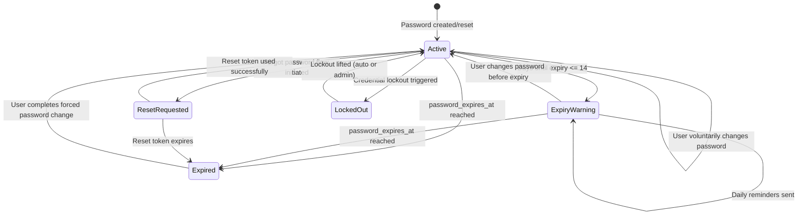
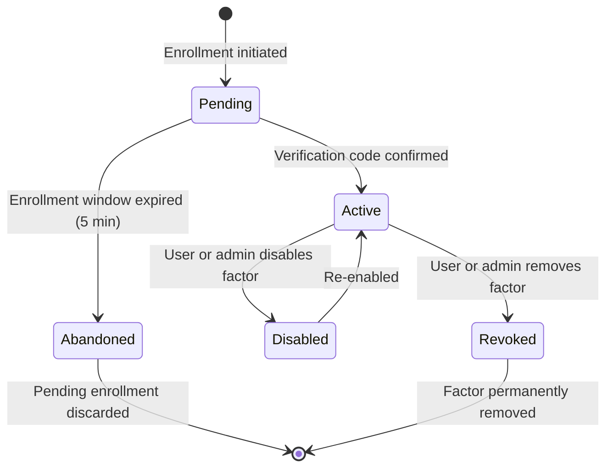
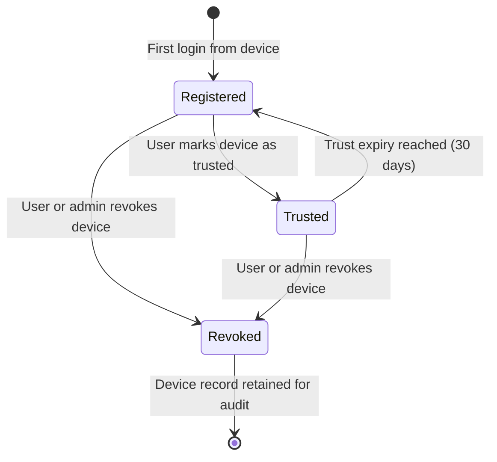
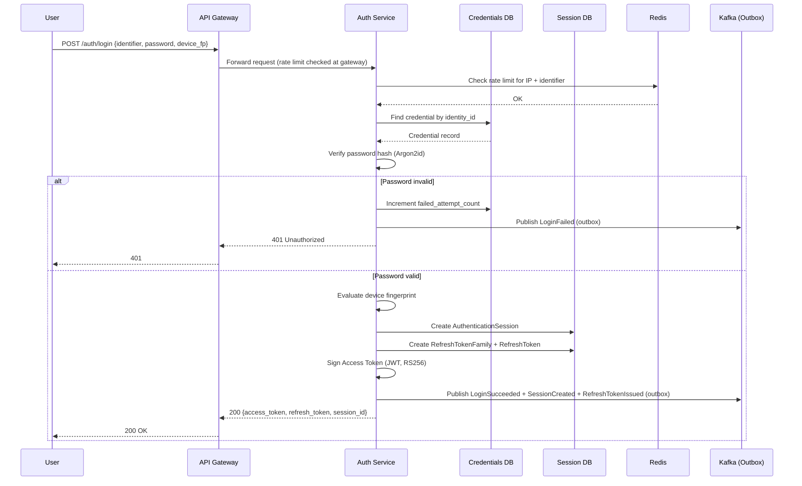
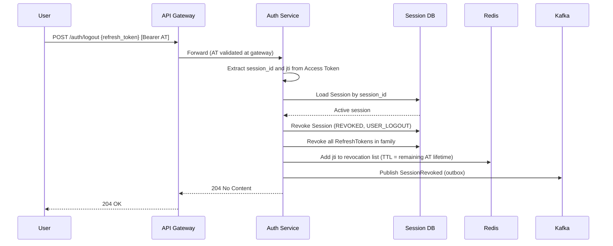
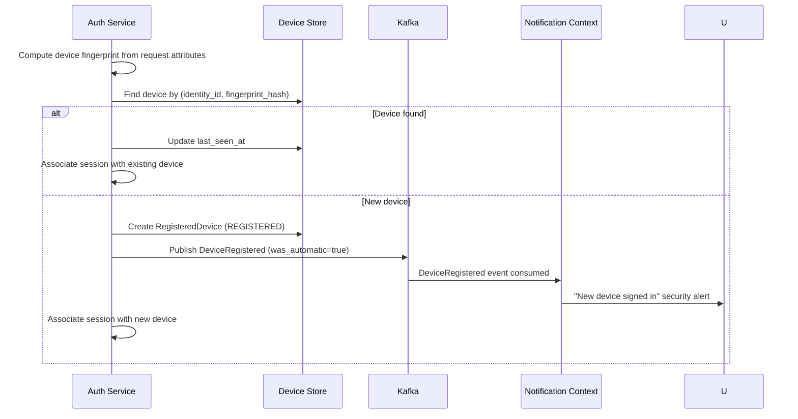
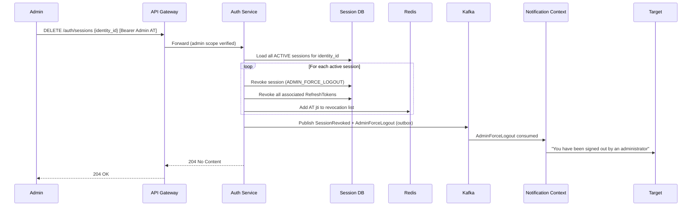

# Product Requirements Document
## Authentication Module — Corporate Banking Platform

**Document Version:** 1.0.0
**Classification:** Internal — Confidential
**Status:** Draft for Review
**Date:** 2026-06-30

---

# Table of Contents

1. Executive Summary
2. Business Capability Analysis
3. Domain Discovery
4. Ubiquitous Language
5. Bounded Context
6. Context Map
7. Domain Model
8. Functional Requirements
9. User Stories & Acceptance Criteria
10. Architecture
11. REST API Design
12. Database Design
13. Domain Events
14. State Machines
15. Sequence Diagrams
16. Security Design
17. Non-Functional Requirements
18. Risks
19. Future Enhancements

---

# 1. Executive Summary

The Authentication Module is a foundational platform capability for the Corporate Banking Ecosystem. It exists as a standalone, independently deployable service responsible for one narrowly defined concern: **proving that a principal is who they claim to be, and issuing verifiable proof of that fact to downstream systems**.

Every application in the Corporate Banking Ecosystem — the Bank Administration Portal, the Corporate Portal, the Mobile Approval application, and the Public API gateway — depends on this module to establish the identity of users and client systems before any business operation is permitted.

## Strategic Intent

Authentication is not a feature. It is an infrastructure capability on the critical path of every interaction in the platform. A failure in authentication is a failure of the entire platform. A security breach in authentication is a breach of the entire banking ecosystem. This demands that the module be designed with:

- **Zero tolerance for security compromise** — every design decision must favor security over convenience
- **Maximum operational availability** — authentication must be more resilient than any downstream service it protects
- **Complete auditability** — every authentication event must be recorded with immutable, tamper-evident logs
- **Protocol standards compliance** — the implementation must conform to OAuth 2.0 (RFC 6749), OpenID Connect 1.0, and FIDO2 to ensure interoperability and avoid proprietary lock-in

## Scope Boundary

This module is **not** responsible for what an authenticated user is allowed to do. Authorization, roles, permissions, product licensing, and corporate structures belong to separate bounded contexts. The Authentication Module issues a cryptographically signed token that downstream systems use to make authorization decisions. The authentication module's job ends the moment a verified token is issued.

## Key Outcomes

| Outcome | Measure |
|---|---|
| Prevent unauthorized access | Zero successful credential-based breaches |
| Support regulatory compliance | Full compliance with PCI-DSS, ISO 27001, local banking regulations |
| Enable frictionless legitimate access | >99.5% of valid login flows complete within 3 seconds |
| Provide auditability | 100% of authentication events captured with sub-second latency |
| Support operational resilience | 99.99% availability SLA |

---

# 2. Business Capability Analysis

## 2.1 Why Authentication Exists

In a corporate banking context, digital interactions carry significant financial and legal consequences. A payment instruction executed by an unauthenticated or impersonated party can result in irreversible financial loss, regulatory sanction, reputational damage, and legal liability.

Authentication exists to solve one fundamental business problem: **establish a trustworthy binding between a digital claim of identity and a verified real-world identity before consequential business operations are permitted**.

Without authentication:
- Any caller could impersonate any user or system
- Downstream services have no reliable identity to make authorization decisions against
- Audit trails cannot be attributed to verified parties
- Regulatory requirements for "know your user" cannot be met

## 2.2 Business Capability Provided

Authentication provides the platform capability of **Identity Verification and Proof Issuance**:

| Capability | Description |
|---|---|
| Credential Verification | Validate that a principal possesses the secret(s) associated with a claimed identity |
| Multi-Factor Challenge | Apply layered verification challenges that increase assurance level |
| Proof of Authentication Issuance | Produce a cryptographically verifiable artifact (token) attesting to successful verification |
| Session Lifecycle Management | Track and govern the duration and validity of verified authentication states |
| Device Trust Establishment | Bind authenticated sessions to verified devices to reduce attack surface |
| Token Lifecycle Management | Issue, rotate, validate, and revoke proof-of-authentication artifacts |
| Audit Trail Generation | Emit immutable event records for every authentication event |
| Account Protection | Detect and respond to credential-based attacks (brute force, stuffing) |

## 2.3 Problems Solved

| Problem | Authentication Solution |
|---|---|
| Impersonation risk | Multi-factor credential verification |
| Credential theft exploitation | Short-lived tokens + refresh rotation |
| Brute force attacks | Progressive lockout + rate limiting |
| Session hijacking | Device binding + secure session lifecycle |
| Regulatory non-compliance | Complete audit trails + MFA enforcement |
| Insider threats | Force logout + session revocation |
| Shared credential abuse | Per-device registration + anomaly detection |

## 2.4 Capabilities That Belong Outside Authentication

| Capability | Correct Bounded Context | Reason |
|---|---|---|
| What a user can access | Authorization / Permission Context | Deciding allowed actions is separate from verifying identity |
| Which roles a user has | Role Management Context | Role assignment is a business management concern |
| Which products a corporate can use | Product Licensing Context | Licensing is a commercial, not identity, concern |
| User profile management | Identity Context | User data is owned by Identity, not Authentication |
| Corporate structure | Corporate Management Context | Organizational hierarchy is a business domain |
| Approval workflows | Workflow Context | Multi-party approval is a transaction concern |
| Payment processing | Payment Context | Business transactions follow from identity; they do not constitute it |

---

# 3. Domain Discovery

Domain Discovery was performed using Event Storming methodology, examining the authentication journey from the perspective of every actor in the Corporate Banking Ecosystem.

## 3.1 Actors Identified

| Actor | Type | Interaction Pattern |
|---|---|---|
| Bank Administrator | Human | Web browser via Bank Administration Portal |
| Corporate User | Human | Web browser via Corporate Portal |
| Mobile Approver | Human | Native mobile application |
| API Client (Machine) | System | OAuth2 Client Credentials flow |
| Downstream Service | System | Token introspection |
| Fraud/Risk System | System | Event subscriber |
| Audit System | System | Event subscriber |
| Notification Service | System | Event subscriber |

## 3.2 Key Domain Events Discovered (Raw)

1. Login attempt initiated
2. Credential submitted
3. Credential verified / rejected
4. MFA challenge triggered
5. MFA code submitted
6. MFA verified / rejected
7. Authentication succeeded
8. Authentication failed
9. Account locked
10. Session created
11. Token issued
12. Device registered
13. Device trusted
14. Session expired (idle)
15. Session expired (absolute)
16. Session revoked (user-initiated)
17. Session revoked (force logout)
18. Refresh token rotated
19. Refresh token revoked
20. Password change requested
21. Password changed
22. Password reset requested
23. Password reset completed
24. Password expired

## 3.3 Commands Identified

| Command | Triggered By |
|---|---|
| SubmitCredentials | User |
| SubmitMFACode | User |
| RegisterDevice | User |
| RevokeDevice | User / Admin |
| LogOut | User |
| ForceLogOut | Admin |
| RefreshAccessToken | Client System |
| RequestPasswordReset | User |
| ChangePassword | User |
| ResetPassword | User (with token) |
| RevokeRefreshToken | System / Admin |
| IntrospectToken | Downstream Service |
| LockAccount | System (policy) |
| UnlockAccount | Admin |

---

# 4. Ubiquitous Language

**Authentication**
The process by which the system verifies that a principal (user or client system) possesses the credentials associated with a claimed identity. Authentication answers the question: *"Are you who you say you are?"* It does not answer *"What are you allowed to do?"*

**Identity**
A stable, unique representation of a real-world entity (person or system) within the platform. Identity is owned by the Identity bounded context. The Authentication Module receives identity references but does not manage identity lifecycle.

**Credential**
A secret or possession held by a principal that can be used to prove control of an Identity. Examples: a password (knowledge factor), an OTP code (possession factor), a biometric (inherence factor), a FIDO2 authenticator (possession factor).

**Authentication Factor**
A category of evidence used to verify identity:
- **Knowledge** — something only the user knows (password, PIN)
- **Possession** — something only the user has (phone, hardware token, authenticator app)
- **Inherence** — something the user is (biometric: fingerprint, face)

**Multi-Factor Authentication (MFA)**
An authentication flow that requires successful verification of credentials from two or more distinct authentication factors.

**OTP (One-Time Password)**
A time-limited, single-use numeric code sent to a registered out-of-band channel (e.g., SMS or email) or generated by a TOTP application.

**TOTP (Time-based One-Time Password)**
An OTP algorithm (RFC 6238) that generates a 6–8 digit code using a shared secret and the current time window.

**FIDO2 / WebAuthn**
A modern, phishing-resistant authentication standard that uses public-key cryptography. The authenticator holds a private key; the server stores only the public key.

**Passkey**
A FIDO2 credential synchronized across a user's devices via a cloud keychain. Enables passwordless authentication without requiring a dedicated hardware token.

**Session**
A server-side record representing a verified, active authentication state for a principal. Created upon successful authentication and terminated upon logout, expiry, or revocation.

**Idle Timeout**
A session expiration policy that terminates a session if no activity is detected within a configured duration (default: 15 minutes).

**Absolute Timeout**
A session expiration policy that terminates a session after a fixed maximum duration regardless of activity (default: 8 hours from creation).

**Access Token**
A short-lived, cryptographically signed credential (JWT) issued upon successful authentication. Carries claims about the authenticated principal. Typical lifetime: 5–15 minutes.

**Refresh Token**
A long-lived, opaque credential that allows a client to obtain a new Access Token without re-authenticating. Subject to rotation and revocation. Typical lifetime: hours to days.

**Refresh Token Rotation**
A security technique where every use of a Refresh Token issues a new Refresh Token and invalidates the previous one.

**Token Introspection**
A server-side capability (RFC 7662) that allows a Resource Server to validate an Access Token and retrieve its claims in real-time.

**Authentication Attempt**
A single, time-stamped record of a credential submission event, recording the outcome, principal identity, source IP, device fingerprint, user agent, and timestamp.

**Account Lockout**
A security policy that temporarily or permanently disables credential verification for an identity after a configured number of failed Authentication Attempts within a time window.

**Device**
A computing endpoint that has been registered and optionally trusted within the Authentication Module.

**Trusted Device**
A Device that has successfully completed device verification and has been granted elevated trust by the user or administrator.

**Device Fingerprint**
A collection of stable, device-specific attributes combined into a hash used to recognize returning devices.

**Password Policy**
A set of configurable rules governing acceptable password characteristics and their lifecycle.

**Password History**
A record of previously used password hashes, used to prevent credential reuse.

**Authentication Assurance Level (AAL)**
A standardized measure (NIST SP 800-63B) of confidence that an authentication event is genuine:
- **AAL1** — Single factor (password only)
- **AAL2** — Multi-factor (password + OTP/TOTP)
- **AAL3** — Hardware-backed multi-factor (FIDO2 with hardware authenticator)

**Force Logout**
An administrative action that immediately invalidates all active Sessions and Refresh Tokens for an identity.

---

# 5. Bounded Context

## 5.1 Authentication Bounded Context: Definition

The **Authentication Bounded Context** is a self-contained domain responsible for:

1. Verifying that a principal possesses valid credentials for a claimed identity
2. Managing the lifecycle of those credentials (passwords, MFA factors)
3. Issuing cryptographically verifiable proof of authentication (Access Tokens, Refresh Tokens)
4. Managing the lifecycle of authentication sessions and tokens
5. Recording all authentication events for audit and security purposes
6. Enforcing authentication security policies (lockout, rate limiting, MFA enforcement)
7. Managing device registration and trust lifecycle

## 5.2 Inside the Authentication Bounded Context

| Concern | Rationale |
|---|---|
| Credential storage and verification | Authentication's primary responsibility |
| Password hashing, history, and policy | Credential lifecycle belongs here |
| MFA factor enrollment and verification | Second-factor verification is an authentication concern |
| Session creation, expiry, revocation | Session is a representation of authenticated state |
| Access Token issuance and signing | Token is the proof of authentication outcome |
| Refresh Token lifecycle | Refresh Token extends the authentication proof |
| Device registration and trust | Device trust affects authentication risk posture |
| Login attempt recording | Attempt records drive lockout and fraud detection |
| Account lockout policy enforcement | Direct response to failed authentication |
| Authentication event emission | Authentication produces domain events for downstream consumption |

## 5.3 Outside the Authentication Bounded Context

| Concern | Why It Belongs Elsewhere |
|---|---|
| User profile (name, email, phone) | Owned by the Identity Context |
| Role assignment | Roles are a business authorization concern |
| Permission evaluation | Evaluated by downstream services using claims in the token |
| Corporate structure | Organizational hierarchy is a business domain |
| Product licensing checks | Commercial entitlements do not belong in identity verification |
| Approval routing | Workflow is a business process |
| OTP/Email notification delivery | Delivered by the Notification Context |
| Fraud scoring | Fraud is a risk domain; Authentication emits events that Fraud subscribes to |

## 5.4 Boundary Justification

The single most important architectural decision is the separation between **Authentication** and **Identity**. Merging them creates coupling that prevents independent scaling, conflates two distinct concerns with different change rates, and makes it impossible to replace the authentication mechanism without affecting user data.

---

# 6. Context Map

## 6.1 Relationship Overview

```
                           ┌──────────────────────────┐
                           │   Authentication Module   │
                           │    (Core Domain)          │
                           └──────────┬───────────────┘
                                      │
          ┌───────────────────────────┼───────────────────────────────┐
          │                           │                               │
          ▼                           ▼                               ▼
  ┌───────────────┐         ┌─────────────────┐            ┌────────────────┐
  │   Identity    │         │   Notification  │            │     Audit      │
  │   Context     │         │   Context       │            │   Context      │
  │ (Upstream)    │         │ (Downstream)    │            │ (Downstream)   │
  └───────────────┘         └─────────────────┘            └────────────────┘
```

## 6.2 Detailed Context Relationships

### Authentication ↔ Identity Context
**Relationship:** Customer/Supplier (Identity is Upstream). Authentication queries Identity for existence/active status via Anti-Corruption Layer. Authentication defines its own `IdentityRef` value object; Identity schema changes only affect the ACL adapter.

### Authentication → Notification Context
**Relationship:** Authentication is Upstream. Asynchronous events trigger notification delivery (OTP, password reset link, security alerts). Authentication never waits on Notification — a notification failure does not cause authentication to fail.

### Authentication → Audit Context
**Relationship:** Authentication is Upstream. All authentication events are emitted asynchronously via Kafka (guaranteed delivery via outbox pattern). Audit Context handles long-term immutable storage and compliance reporting.

### Authentication ↔ Corporate Context
**Relationship:** Corporate is Upstream. Authentication queries Corporate for corporate-level MFA policy at login time. Policies are cached (short TTL). If Corporate is unavailable, the most restrictive policy is applied (fail secure).

### Authentication ↔ Product Licensing Context
**Relationship:** Product Licensing is Upstream. License checked at MFA enrollment time (not login time) to determine if premium factors are available. Avoids hard runtime dependency at login.

### Authentication → Fraud/Risk Context
**Relationship:** Authentication is Upstream. Authentication emits `LoginSucceeded`, `LoginFailed`, `AccountLocked`, `NewDeviceRegistered` events. Fraud Context may respond with Force Logout or account lock commands (inbound command from Fraud).

---

# 7. Domain Model

## 7.1 Aggregates

### Aggregate 1: `AuthenticationSession`
Protects invariants: a session cannot be both active and expired; a revoked session cannot be reactivated; expiry times are immutable after creation.

**Contains:** Session ID, Identity Reference, Device Reference, AAL, Session Status (`ACTIVE`/`EXPIRED`/`REVOKED`), Creation Timestamp, Last Activity Timestamp, Idle Timeout, Absolute Expiry, MFA Factors Used.

### Aggregate 2: `CredentialAggregate`
Protects invariants: failed attempt count is always consistent with lockout status; password history depth never exceeds policy maximum; a locked credential cannot be verified.

**Contains:** Credential ID, Identity Reference, Password Hash, Password Salt, Password Algorithm/Version, Password Created/Expires At, Force Password Change flag, Failed Attempt Count, Lockout Status (`UNLOCKED`/`LOCKED_TEMPORARY`/`LOCKED_PERMANENT`), Locked Until, Password History (entity collection).

### Aggregate 3: `MFAFactor`
Protects invariants: a factor in `PENDING` state cannot be used for verification; recovery codes are single-use and must be marked consumed atomically.

**Contains:** Factor ID, Identity Reference, Factor Type (`TOTP`/`SMS_OTP`/`FIDO2`/`PASSKEY`), Enrollment Status (`PENDING`/`ACTIVE`/`DISABLED`/`REVOKED`), Factor Secret or Public Key, FIDO2 Counter, Recovery Codes (entity collection).

### Aggregate 4: `RegisteredDevice`
Protects invariants: a revoked device cannot be trusted; device fingerprint is immutable after registration; trust expiry is always in the future at the time of setting.

**Contains:** Device ID, Identity Reference, Device Fingerprint, Device Name, Trust Status (`REGISTERED`/`TRUSTED`/`REVOKED`), Trust Expires At, Registered At, Last Seen At, Registration IP.

### Aggregate 5: `RefreshTokenFamily`
Protects invariants: only one token in a family can be `ACTIVE` at a time; once a family is `COMPROMISED`, all tokens must be `REVOKED`; a token can only be used once.

**Contains:** Family ID, Session Reference, Identity Reference, Family Status (`ACTIVE`/`REVOKED`/`COMPROMISED`), Token Chain (ordered `RefreshToken` entity collection).

## 7.2 Entities (within Aggregates)

| Entity | Aggregate | Key Attributes |
|---|---|---|
| `PasswordHistoryEntry` | CredentialAggregate | hash, created_at |
| `RecoveryCode` | MFAFactor | code_hash, is_used, used_at |
| `RefreshToken` | RefreshTokenFamily | token_hash, status, issued_at, expires_at, used_at |

## 7.3 Value Objects

| Value Object | Used In | Why a Value Object |
|---|---|---|
| `IdentityRef` | All aggregates | Opaque reference; equality by value |
| `PasswordHash` | CredentialAggregate | Encapsulates Argon2id hashing logic |
| `DeviceFingerprint` | RegisteredDevice | Computed from attributes; immutable |
| `AuthenticationAssuranceLevel` | AuthenticationSession | Enum-like; equality by value |
| `TokenClaims` | Domain Service | Immutable bag of JWT claims |
| `IPAddress` | Login Attempt | Immutable; equality by value |

## 7.4 Domain Services

| Service | Responsibility |
|---|---|
| `CredentialVerificationService` | Verifies a submitted password against the stored credential via hashing port |
| `MFAVerificationService` | Verifies OTP/TOTP/FIDO2 assertions; manages time-window comparison; validates FIDO2 counter |
| `TokenIssuanceService` | Creates and cryptographically signs Access Tokens (JWTs) |
| `SessionPolicyEnforcementService` | Evaluates idle and absolute timeout at refresh and resource access |
| `LockoutPolicyService` | Evaluates whether a failed attempt should trigger lockout |
| `PasswordPolicyService` | Validates proposed passwords against active policy |

## 7.5 Repositories (Ports)

| Repository Port | Operations |
|---|---|
| `AuthenticationSessionRepository` | Find by ID, Find active by identity, Save, Delete |
| `CredentialRepository` | Find by identity_id, Save |
| `MFAFactorRepository` | Find by identity_id and type, Find active by identity, Save |
| `RegisteredDeviceRepository` | Find by device_id, Find by identity_id and fingerprint, Save |
| `RefreshTokenFamilyRepository` | Find by token_hash, Find by session_id, Save |
| `LoginAttemptRepository` | Save, Count failures by identity in window |

---

# 8. Functional Requirements

## 8.1 Login

**FR-LOGIN-001: Username/Password Authentication**
Accept a username and password, verify against stored hash using Argon2id, return the authentication result.

**FR-LOGIN-002: Email/Password Authentication (Future-Ready)**
Architecture must support email as a login identifier without schema changes. Credential lookup must be identifier-type agnostic. Implementation deferred to Phase 2.

**FR-LOGIN-003: Failed Login Handling**
- Increment failed attempt counter on each failure
- Return a generic error message that does not distinguish between "user not found" and "wrong password"
- Apply configurable lockout policy after N consecutive failures within a time window (default: 5 failures in 15 minutes)
- Emit `LoginFailed` domain event

**FR-LOGIN-004: Account Lockout**
Two lockout modes:
- **Temporary Lockout:** Locked for configurable duration (default: 30 minutes), then auto-unlocked
- **Permanent Lockout:** Locked indefinitely; requires administrator to unlock

Escalation policy (configurable): First lockout → Temporary (30 min); Second → Temporary (2 hours); Third → Permanent.

**FR-LOGIN-005: Login Audit**
Every login attempt (success and failure) must be persisted as a `LoginAttempt` record containing: identity_id, timestamp, outcome, failure_reason, ip_address, user_agent, device_fingerprint, session_id (if successful).

**FR-LOGIN-006: Simultaneous Session Policy**
Configurable policies: Allow all concurrent sessions; Limit N (oldest invalidated); Single session (prior revoked on new login).

## 8.2 Multi-Factor Authentication

**FR-MFA-001: MFA Factor Types**
- SMS OTP (Phase 1)
- TOTP via authenticator app (Phase 1)
- FIDO2/WebAuthn (Phase 1 for web, Phase 2 for mobile)
- Passkey (Phase 2)

**FR-MFA-002: TOTP Enrollment**
1. Generate cryptographically random 20-byte shared secret
2. Encode as Base32, present as QR code (otpauth:// URI)
3. Require valid TOTP code before enrollment is confirmed
4. Store secret encrypted at rest
5. Generate and present 10 single-use recovery codes
6. Transition factor status to `ACTIVE`

**FR-MFA-003: TOTP Verification**
- Accept 6-digit code
- Validate against current and ±1 time windows (30-second windows; allows 30s clock skew)
- Reject previously used codes within the same time window (replay prevention)
- Track consecutive TOTP failures and apply lockout policy

**FR-MFA-004: SMS OTP**
- Generate cryptographically random 6-digit numeric code
- Store hashed OTP with expiry (default: 5 minutes)
- Send via Notification Context (async)
- One-time use; invalidate on use or expiry
- Rate limit: 3 OTP sends per 10-minute window per identity

**FR-MFA-005: FIDO2/WebAuthn Enrollment**
- Follow W3C WebAuthn Level 2 specification
- Support platform and roaming authenticators
- Store credential public key, credential ID, and AAGUID
- Initialize counter to 0 at enrollment
- Require user presence (UP) flag; optionally user verification (UV) flag

**FR-MFA-006: FIDO2/WebAuthn Verification**
- Generate server-side challenge (minimum 16 random bytes)
- Validate: rpIdHash, flags (UP required), counter (must be > stored counter)
- Validate client data JSON: challenge matches, origin matches, type is `webauthn.get`
- Update stored counter on successful verification

**FR-MFA-007: MFA Recovery**
- 10 recovery codes per factor (8 characters alphanumeric, stored hashed)
- Each code is single-use
- When fewer than 3 codes remain, prompt user to regenerate
- Recovery code use emits `MFARecoveryCodeUsed` event

**FR-MFA-008: MFA Enrollment Lifecycle**
States: `PENDING` → `ACTIVE` → `DISABLED` or `REVOKED`

**FR-MFA-009: MFA Policy Enforcement**
Corporate-level policy can mandate MFA. If mandatory and user has no active factor, they must enroll before completing login.

## 8.3 Session Management

**FR-SESSION-001: Session Creation**
On successful authentication, create `AuthenticationSession` with unique session ID, identity reference, device reference, AAL, timestamps, idle timeout, absolute expiry, status `ACTIVE`.

**FR-SESSION-002: Session Expiration**
Both idle timeout (default: 15 min) and absolute timeout (default: 8 hours) are independently enforced. Expiry is evaluated lazily (at token refresh) and eagerly (background sweeper).

**FR-SESSION-003: Session Revocation**
Immediately revokable via: user-initiated logout, admin force logout, security event. Revocation immediately invalidates all associated Refresh Tokens.

**FR-SESSION-004: Session Query**
Authenticated user can list their own active sessions. Administrator can list and revoke sessions for any identity.

**FR-SESSION-005: Session Activity Update**
On every successful access token refresh, update `last_activity_at` to reset the idle timeout clock.

## 8.4 Device Management

**FR-DEVICE-001: Device Registration**
Capture device fingerprint on login. Match against existing registered devices. If no match, register new device automatically.

**FR-DEVICE-002: New Device Alert**
Emit `NewDeviceDetected` event on unrecognized device. Notification Context delivers security alert to user.

**FR-DEVICE-003: Trusted Device**
User can mark device as Trusted. Trust has expiry (default: 30 days). Trusted devices may qualify for reduced MFA step-up frequency subject to policy.

**FR-DEVICE-004: Device Revocation**
User or administrator can revoke a device. Immediately invalidates all sessions associated with that device.

**FR-DEVICE-005: Device List**
Authenticated user can view all registered devices and revoke any of them.

## 8.5 Password Management

**FR-PWD-001: Password Policy** (configurable per-corporate)
- Minimum length: 12 characters
- Must contain: uppercase, lowercase, digit, special character
- Maximum length: 128 characters (DoS prevention)
- Common password blocklist (minimum 100,000 entries)
- Username must not be contained in password

**FR-PWD-002: Password History**
Prevent reuse of last N passwords (default: 12). History entries store hashes only.

**FR-PWD-003: Password Expiration**
Default: 90 days (bank admin), 180 days (corporate users). Warnings at 14, 7, 3, 1 day before expiry. On expiry, user is forced to change password before accessing protected resources.

**FR-PWD-004: Forgot Password**
1. User submits identifier; system always returns same response (prevents enumeration)
2. If identity exists: generate short-lived single-use reset token (60-minute TTL)
3. Emit `PasswordResetRequested` event → Notification Context delivers reset link

**FR-PWD-005: Password Reset (via Reset Token)**
1. Validate token (exists, not expired, not used)
2. Validate new password against policy and history
3. Update password hash; mark token consumed
4. Revoke all active sessions
5. Emit `PasswordResetCompleted`

**FR-PWD-006: Change Password (Authenticated)**
1. Verify current password
2. Validate new password against policy and history
3. Update hash; add old password to history
4. Revoke other sessions (configurable; default: revoke all except current)
5. Emit `PasswordChanged`

**FR-PWD-007: Admin-Initiated Password Reset**
Administrator can force password reset for any identity. User must set new password on next login.

## 8.6 Token Management

**FR-TOKEN-001: Access Token Structure**
JWT (RFC 7519) with RS256. Claims: `iss`, `sub` (identity_id), `aud`, `iat`, `exp` (15 min default), `jti`, `session_id`, `aal`, `device_id`, `scope`, `corporate_id`.

**FR-TOKEN-002: Access Token Signing**
RS256 (RSA 2048-bit minimum; RSA 4096-bit preferred). Public key at `/.well-known/jwks.json`. Key rotation every 90 days. Private key in HSM/Vault.

**FR-TOKEN-003: Refresh Token**
Opaque, cryptographically random (minimum 32 bytes). Store only SHA-256 hash server-side. Lifetime: 24 hours (web), 7 days (mobile). Bound to session.

**FR-TOKEN-004: Refresh Token Rotation**
On exchange: validate token, validate session, mark old token `USED`, generate new token, issue new Access Token.
**Reuse detection:** If a `USED` token is submitted, revoke entire token family and associated session. Emit `RefreshTokenFamilyCompromised`.

**FR-TOKEN-005: Token Revocation**
RFC 7009 endpoint. Access Token revocation: add `jti` to Redis revocation list (TTL = remaining lifetime). Refresh Token: update status in PostgreSQL.

**FR-TOKEN-006: Token Introspection**
RFC 7662 endpoint. Resource servers submit token; receive active status and claims.

**FR-TOKEN-007: JWKS Endpoint**
Publish signing public keys at `/.well-known/jwks.json` (RFC 7517).

---

# 9. User Stories & Acceptance Criteria

## US-001: Standard Login
**As a** Corporate User, **I want to** log in with username and password, **So that** I can access the Corporate Portal.

**Acceptance Criteria:**
- Valid credentials return Access Token and Refresh Token within 3 seconds
- Invalid credentials return generic error (no username/password distinction)
- 5 consecutive failures within 15 minutes triggers account lockout
- Every attempt is recorded in the audit log with IP, user agent, and timestamp

## US-002: Login with MFA Required
**As a** Bank Administrator, **I want to** complete MFA after entering my password, **So that** my privileged account is protected by a second factor.

**Acceptance Criteria:**
- Successful password + MFA policy active → system issues MFA challenge token (not full access token)
- Valid TOTP code → full Access Token with AAL2
- Expired MFA session (10-minute window) → MFA challenge rejected; user must restart login
- No active MFA factor + MFA mandatory → user directed to enrollment

## US-003: Account Lockout Recovery
**As a** temporarily locked-out user, **I want to** be automatically unlocked after the lockout period, **So that** I can resume access without administrator intervention.

**Acceptance Criteria:**
- Temporary lockout lifted automatically after configured duration
- Permanent lockout requires administrator action
- Failed attempt counter resets on unlock
- Unlock event recorded in audit log

## US-004: TOTP Enrollment
**As a** Corporate User, **I want to** enroll my authenticator app, **So that** my account is protected by a second factor.

**Acceptance Criteria:**
- QR code presented with valid OTP provisioning URI
- Enrollment only confirmed by submitting valid TOTP code from QR
- 10 single-use recovery codes displayed on successful enrollment
- Recovery codes can be used if device is lost

## US-005: FIDO2 Registration
**As a** Bank Administrator, **I want to** register a security key, **So that** I am protected against phishing attacks.

**Acceptance Criteria:**
- FIDO2 registration flow initiated from security settings
- System challenges key with server-generated random challenge
- Successful response stores public key and activates factor
- Factor appears in active MFA factors list

## US-006: Forgot Password
**As a** user who forgot their password, **I want to** reset it via email link, **So that** I can regain access.

**Acceptance Criteria:**
- Submitting any identifier always shows "if that account exists, you'll receive an email"
- Reset link is single-use and valid for 60 minutes
- New password must meet password policy
- All other sessions are invalidated after reset

## US-007: Force Password Change by Admin
**As a** Bank Administrator, **I want to** force a user to change their password at next login.

**Acceptance Criteria:**
- User can still log in with current password after admin action
- User is redirected to password change screen before accessing any resource
- User cannot bypass the forced change
- Action recorded in audit log

## US-008: New Device Alert
**As a** Corporate User, **I want to** receive an alert when my account logs in from a new device.

**Acceptance Criteria:**
- Login from unregistered device fingerprint → security notification within 60 seconds
- Notification includes device name, IP, and approximate location
- User can revoke new device directly from notification

## US-009: Session Management Dashboard
**As a** Corporate User, **I want to** see and manage all my active sessions.

**Acceptance Criteria:**
- List of active sessions with device name, last activity, and IP
- Any individual session can be revoked
- Revocation immediately invalidates associated tokens
- Current session is clearly identified

---

# 10. Architecture

## 10.1 Architectural Style

Hexagonal Architecture (Ports and Adapters) + Clean Architecture. Independently deployable microservice.

```
┌────────────────────────────────────────────────────────────────────┐
│                    Authentication Service                          │
│                                                                    │
│  ┌──────────────┐    ┌────────────────────────────────────────┐   │
│  │   Primary    │    │              Application               │   │
│  │  Adapters    │───▶│               Layer                    │   │
│  │  (Inbound)   │    │   (Use Cases / Application Services)   │   │
│  │              │    └────────────────┬───────────────────────┘   │
│  │ - REST API   │                     │                            │
│  │ - gRPC       │    ┌────────────────▼───────────────────────┐   │
│  │ - Event      │    │               Domain                   │   │
│  │   Consumer   │    │                Layer                   │   │
│  └──────────────┘    │   (Aggregates, Domain Services,        │   │
│                      │    Repositories [Ports], Events)       │   │
│  ┌──────────────┐    └────────────────┬───────────────────────┘   │
│  │  Secondary   │                     │                            │
│  │  Adapters    │◀───────────────────┘                            │
│  │  (Outbound)  │                                                  │
│  │              │                                                  │
│  │ - PostgreSQL │                                                  │
│  │ - Redis      │                                                  │
│  │ - Kafka      │                                                  │
│  │ - Vault      │                                                  │
│  │ - Identity   │                                                  │
│  │   Client     │                                                  │
│  └──────────────┘                                                  │
└────────────────────────────────────────────────────────────────────┘
```

## 10.2 Technology Stack

| Layer | Technology | Rationale |
|---|---|---|
| Runtime | JVM (Java 21 LTS) or Go 1.22+ | JVM: rich security/crypto ecosystem; Go: performance, low memory |
| Framework | Spring Boot 3 (Java) or stdlib/chi (Go) | Spring Boot for JVM; chi for Go minimalism |
| Database | PostgreSQL 16 | ACID compliance, strong encryption extensions |
| Cache / Session | Redis 7 (Cluster) | Low-latency token validation and revocation list |
| Message Broker | Apache Kafka | Durable, ordered domain event delivery |
| Secret Management | HashiCorp Vault | HSM integration, secret rotation, dynamic credentials |
| Service Mesh | Istio | mTLS, traffic management, observability |
| Container | Docker + Kubernetes | Cloud-native deployment, horizontal scaling |
| Observability | OpenTelemetry + Grafana Stack | Distributed tracing, metrics, log aggregation |

## 10.3 Statelessness Design

All pods are stateless. State is externalized:
- **Session state** → PostgreSQL + Redis (Redis caches hot sessions)
- **Token revocation list** → Redis (TTL matches token lifetime)
- **Refresh token state** → PostgreSQL (durable)
- **Signing keys** → Vault (fetched at startup, cached in memory)
- **Rate limit counters** → Redis

## 10.4 Outbox Pattern for Reliable Event Publishing

1. Domain events written to `outbox` table in the same database transaction as aggregate state change
2. Background relay process reads outbox and publishes to Kafka
3. On successful Kafka acknowledgment, outbox entry marked `PUBLISHED`

This guarantees at-least-once delivery without distributed transactions.

---

# 11. REST API Design

All APIs: JSON, versioned under `/api/v1/auth`, HTTPS required. Errors conform to RFC 7807.

## Standard Error Response

```json
{
  "type": "https://auth.bank.com/errors/invalid-credentials",
  "title": "Invalid Credentials",
  "status": 401,
  "detail": "The provided credentials are incorrect.",
  "instance": "/api/v1/auth/login",
  "trace_id": "a3f9b2c1-1234-5678-abcd-ef1234567890"
}
```

## 11.1 Login APIs

### POST /api/v1/auth/login

**Request:**
```json
{
  "identifier": "john.smith",
  "password": "S3cur3P@ssword!",
  "device_fingerprint": {
    "user_agent": "Mozilla/5.0...",
    "screen_resolution": "1920x1080",
    "timezone": "Asia/Jakarta",
    "language": "en-US",
    "platform": "Win32"
  },
  "client_id": "corporate-portal"
}
```

**Response 200 — MFA not required:**
```json
{
  "authentication_result": "COMPLETED",
  "access_token": "eyJhbGciOiJSUzI1NiIsInR...",
  "token_type": "Bearer",
  "expires_in": 900,
  "refresh_token": "dGhpcyBpcyBhIHNlY3...",
  "session_id": "sess_01H9XZ7K2...",
  "aal": "AAL1"
}
```

**Response 200 — MFA required:**
```json
{
  "authentication_result": "MFA_REQUIRED",
  "mfa_session_token": "mfa_sess_7Xyz...",
  "mfa_session_expires_in": 600,
  "available_factors": ["TOTP", "SMS_OTP"],
  "masked_phone": "+62-***-****-7890"
}
```

**Response 401:** Generic invalid credentials error.
**Response 423:** Account locked (includes `locked_until`).
**Response 429:** Rate limited (includes `retry_after`).

### POST /api/v1/auth/mfa/verify

**Request:**
```json
{
  "mfa_session_token": "mfa_sess_7Xyz...",
  "factor_type": "TOTP",
  "code": "482931"
}
```

**Response 200:** Full access token response with `aal: "AAL2"`.

### POST /api/v1/auth/logout

**Headers:** `Authorization: Bearer <access_token>`
**Request:** `{ "refresh_token": "..." }`
**Response:** 204 No Content.

## 11.2 Token APIs

### POST /api/v1/auth/token/refresh

**Request:** `{ "refresh_token": "...", "client_id": "corporate-portal" }`
**Response 200:** New access token + new refresh token.
**Response 401 (reuse detected):** All sessions revoked; error message indicates security anomaly.

### POST /api/v1/auth/token/revoke (RFC 7009)

**Request:** `{ "token": "...", "token_type_hint": "refresh_token" }`
**Response:** Always 200 (prevents enumeration).

### POST /api/v1/auth/token/introspect (RFC 7662)

**Headers:** `Authorization: Basic <client_id:client_secret>`
**Request:** `{ "token": "...", "token_type_hint": "access_token" }`

**Response 200 — Active:**
```json
{
  "active": true,
  "sub": "identity_01H9XZ...",
  "iss": "https://auth.bank.com",
  "aud": ["corporate-portal"],
  "iat": 1719720000,
  "exp": 1719720900,
  "jti": "token_abc123...",
  "session_id": "sess_01H9XZ7K2...",
  "aal": "AAL2",
  "device_id": "dev_xyz789...",
  "corporate_id": "corp_abc123...",
  "scope": "read:payments write:payments"
}
```

**Response 200 — Inactive:** `{ "active": false }`

### GET /.well-known/jwks.json

Returns current and previous signing public keys in JWK Set format.

## 11.3 MFA APIs

### GET /api/v1/auth/mfa/factors
Lists enrolled MFA factors for authenticated user.

### POST /api/v1/auth/mfa/totp/enroll
Returns `enrollment_id`, `otpauth_uri`, `qr_code_data_url`, `expires_in`.

### POST /api/v1/auth/mfa/totp/confirm
Confirms enrollment; returns `factor_id`, `status`, `recovery_codes` (array of 10).

### POST /api/v1/auth/mfa/fido2/register/begin
Returns `enrollment_id` and `public_key_credential_creation_options`.

### POST /api/v1/auth/mfa/fido2/register/complete
Accepts WebAuthn attestation response. Returns `factor_id`, `status`.

### DELETE /api/v1/auth/mfa/factors/{factor_id}
Revokes an MFA factor. Requires re-authentication.

## 11.4 Device APIs

### GET /api/v1/auth/devices
Lists registered devices with trust status, last seen, registration IP.

### PATCH /api/v1/auth/devices/{device_id}
Updates device name or trust status.

### DELETE /api/v1/auth/devices/{device_id}
Revokes device and all associated sessions. Returns 204.

## 11.5 Password APIs

### POST /api/v1/auth/password/change
**Request:** `{ "current_password": "...", "new_password": "..." }`
**Response:** 204 No Content.

### POST /api/v1/auth/password/forgot
**Request:** `{ "identifier": "john.smith" }`
**Response:** Always 200 with generic message.

### POST /api/v1/auth/password/reset
**Request:** `{ "reset_token": "...", "new_password": "..." }`
**Response:** 204 No Content.

## 11.6 Session APIs

### GET /api/v1/auth/sessions
Lists active sessions with device name, timestamps, IP, AAL.

### DELETE /api/v1/auth/sessions/{session_id}
Revokes specific session (cannot revoke current session via this endpoint).

### DELETE /api/v1/auth/sessions (Admin only)
Force logout: revokes all sessions for given identity_id.

---

# 12. Database Design

## 12.1 Design Principles

- Normalized relational schema (3NF minimum)
- No sensitive data in plaintext (passwords, OTP secrets, token values are hashed or encrypted)
- Hard delete with audit trail (no soft delete on security-sensitive tables)
- UUIDs as primary keys (prevents enumeration)
- Foreign keys enforce referential integrity

## 12.2 Table Definitions

### credentials

```sql
CREATE TABLE credentials (
    id                    UUID PRIMARY KEY DEFAULT gen_random_uuid(),
    identity_id           UUID NOT NULL UNIQUE,
    password_hash         VARCHAR(255) NOT NULL,
    password_salt         VARCHAR(64) NOT NULL,
    password_algorithm    VARCHAR(32) NOT NULL DEFAULT 'argon2id',
    password_version      INT NOT NULL DEFAULT 1,
    password_created_at   TIMESTAMPTZ NOT NULL,
    password_expires_at   TIMESTAMPTZ,
    force_password_change BOOLEAN NOT NULL DEFAULT FALSE,
    failed_attempt_count  INT NOT NULL DEFAULT 0,
    last_failed_at        TIMESTAMPTZ,
    lockout_status        VARCHAR(32) NOT NULL DEFAULT 'UNLOCKED',
    locked_at             TIMESTAMPTZ,
    locked_until          TIMESTAMPTZ,
    created_at            TIMESTAMPTZ NOT NULL DEFAULT NOW(),
    updated_at            TIMESTAMPTZ NOT NULL DEFAULT NOW()
);
CREATE INDEX idx_credentials_identity_id ON credentials(identity_id);
CREATE INDEX idx_credentials_lockout_status ON credentials(lockout_status) WHERE lockout_status != 'UNLOCKED';
```

### password_history

```sql
CREATE TABLE password_history (
    id             UUID PRIMARY KEY DEFAULT gen_random_uuid(),
    credential_id  UUID NOT NULL REFERENCES credentials(id) ON DELETE CASCADE,
    password_hash  VARCHAR(255) NOT NULL,
    password_salt  VARCHAR(64) NOT NULL,
    algorithm      VARCHAR(32) NOT NULL,
    created_at     TIMESTAMPTZ NOT NULL DEFAULT NOW()
);
CREATE INDEX idx_password_history_credential ON password_history(credential_id, created_at DESC);
```

### mfa_factors

```sql
CREATE TABLE mfa_factors (
    id                        UUID PRIMARY KEY DEFAULT gen_random_uuid(),
    identity_id               UUID NOT NULL,
    factor_type               VARCHAR(32) NOT NULL,
    status                    VARCHAR(32) NOT NULL DEFAULT 'PENDING',
    display_name              VARCHAR(128),
    totp_secret_encrypted     VARCHAR(512),
    totp_algorithm            VARCHAR(16) DEFAULT 'SHA1',
    totp_digits               INT DEFAULT 6,
    totp_period               INT DEFAULT 30,
    phone_number_masked       VARCHAR(32),
    fido2_credential_id       BYTEA,
    fido2_public_key          BYTEA,
    fido2_aaguid              UUID,
    fido2_counter             BIGINT DEFAULT 0,
    fido2_user_present        BOOLEAN,
    fido2_user_verified       BOOLEAN,
    fido2_attestation_type    VARCHAR(64),
    enrolled_at               TIMESTAMPTZ,
    last_used_at              TIMESTAMPTZ,
    last_failed_at            TIMESTAMPTZ,
    failed_count              INT NOT NULL DEFAULT 0,
    created_at                TIMESTAMPTZ NOT NULL DEFAULT NOW(),
    updated_at                TIMESTAMPTZ NOT NULL DEFAULT NOW()
);
CREATE INDEX idx_mfa_factors_identity ON mfa_factors(identity_id, status);
CREATE UNIQUE INDEX idx_mfa_fido2_credential ON mfa_factors(fido2_credential_id) WHERE fido2_credential_id IS NOT NULL;
```

### mfa_recovery_codes

```sql
CREATE TABLE mfa_recovery_codes (
    id          UUID PRIMARY KEY DEFAULT gen_random_uuid(),
    factor_id   UUID NOT NULL REFERENCES mfa_factors(id) ON DELETE CASCADE,
    code_hash   VARCHAR(255) NOT NULL,
    is_used     BOOLEAN NOT NULL DEFAULT FALSE,
    used_at     TIMESTAMPTZ,
    created_at  TIMESTAMPTZ NOT NULL DEFAULT NOW()
);
CREATE INDEX idx_mfa_recovery_codes_factor ON mfa_recovery_codes(factor_id, is_used);
```

### mfa_pending_otps

```sql
CREATE TABLE mfa_pending_otps (
    id            UUID PRIMARY KEY DEFAULT gen_random_uuid(),
    identity_id   UUID NOT NULL,
    factor_id     UUID REFERENCES mfa_factors(id),
    otp_hash      VARCHAR(255) NOT NULL,
    purpose       VARCHAR(32) NOT NULL,
    is_used       BOOLEAN NOT NULL DEFAULT FALSE,
    expires_at    TIMESTAMPTZ NOT NULL,
    attempt_count INT NOT NULL DEFAULT 0,
    created_at    TIMESTAMPTZ NOT NULL DEFAULT NOW()
);
CREATE INDEX idx_mfa_otps_identity_purpose ON mfa_pending_otps(identity_id, purpose, is_used, expires_at);
```

### authentication_sessions

```sql
CREATE TABLE authentication_sessions (
    id                  UUID PRIMARY KEY DEFAULT gen_random_uuid(),
    identity_id         UUID NOT NULL,
    device_id           UUID REFERENCES registered_devices(id),
    status              VARCHAR(32) NOT NULL DEFAULT 'ACTIVE',
    aal                 VARCHAR(8) NOT NULL DEFAULT 'AAL1',
    mfa_factors_used    JSONB,
    created_at          TIMESTAMPTZ NOT NULL DEFAULT NOW(),
    last_activity_at    TIMESTAMPTZ NOT NULL DEFAULT NOW(),
    idle_timeout_secs   INT NOT NULL DEFAULT 900,
    absolute_expires_at TIMESTAMPTZ NOT NULL,
    revoked_at          TIMESTAMPTZ,
    revoke_reason       VARCHAR(64),
    creation_ip         INET NOT NULL,
    creation_user_agent TEXT
);
CREATE INDEX idx_sessions_identity_status ON authentication_sessions(identity_id, status) WHERE status = 'ACTIVE';
CREATE INDEX idx_sessions_device ON authentication_sessions(device_id) WHERE device_id IS NOT NULL;
CREATE INDEX idx_sessions_expires ON authentication_sessions(absolute_expires_at) WHERE status = 'ACTIVE';
```

### refresh_token_families

```sql
CREATE TABLE refresh_token_families (
    id           UUID PRIMARY KEY DEFAULT gen_random_uuid(),
    session_id   UUID NOT NULL REFERENCES authentication_sessions(id),
    identity_id  UUID NOT NULL,
    status       VARCHAR(32) NOT NULL DEFAULT 'ACTIVE',
    revoked_at   TIMESTAMPTZ,
    revoke_reason VARCHAR(64),
    created_at   TIMESTAMPTZ NOT NULL DEFAULT NOW(),
    updated_at   TIMESTAMPTZ NOT NULL DEFAULT NOW()
);
CREATE INDEX idx_rtf_session ON refresh_token_families(session_id);
CREATE INDEX idx_rtf_identity_status ON refresh_token_families(identity_id, status);
```

### refresh_tokens

```sql
CREATE TABLE refresh_tokens (
    id          UUID PRIMARY KEY DEFAULT gen_random_uuid(),
    family_id   UUID NOT NULL REFERENCES refresh_token_families(id) ON DELETE CASCADE,
    token_hash  VARCHAR(64) NOT NULL UNIQUE,
    status      VARCHAR(32) NOT NULL DEFAULT 'ACTIVE',
    client_id   VARCHAR(128) NOT NULL,
    issued_at   TIMESTAMPTZ NOT NULL DEFAULT NOW(),
    expires_at  TIMESTAMPTZ NOT NULL,
    used_at     TIMESTAMPTZ,
    revoked_at  TIMESTAMPTZ,
    issuer_ip   INET
);
CREATE INDEX idx_refresh_tokens_hash ON refresh_tokens(token_hash);
CREATE INDEX idx_refresh_tokens_family ON refresh_tokens(family_id);
CREATE INDEX idx_refresh_tokens_expires ON refresh_tokens(expires_at) WHERE status = 'ACTIVE';
```

### registered_devices

```sql
CREATE TABLE registered_devices (
    id                  UUID PRIMARY KEY DEFAULT gen_random_uuid(),
    identity_id         UUID NOT NULL,
    fingerprint_hash    VARCHAR(64) NOT NULL,
    fingerprint_version INT NOT NULL DEFAULT 1,
    display_name        VARCHAR(128),
    user_agent          TEXT,
    trust_status        VARCHAR(32) NOT NULL DEFAULT 'REGISTERED',
    trust_expires_at    TIMESTAMPTZ,
    registered_at       TIMESTAMPTZ NOT NULL DEFAULT NOW(),
    last_seen_at        TIMESTAMPTZ,
    registration_ip     INET,
    revoked_at          TIMESTAMPTZ
);
CREATE INDEX idx_devices_identity ON registered_devices(identity_id, trust_status);
CREATE UNIQUE INDEX idx_devices_fingerprint ON registered_devices(identity_id, fingerprint_hash) WHERE trust_status != 'REVOKED';
```

### login_attempts

```sql
CREATE TABLE login_attempts (
    id                  UUID PRIMARY KEY DEFAULT gen_random_uuid(),
    identity_id         UUID,
    identifier_used     VARCHAR(256) NOT NULL,
    outcome             VARCHAR(32) NOT NULL,
    failure_reason      VARCHAR(64),
    session_id          UUID REFERENCES authentication_sessions(id),
    device_id           UUID REFERENCES registered_devices(id),
    ip_address          INET NOT NULL,
    user_agent          TEXT,
    device_fingerprint  VARCHAR(64),
    attempted_at        TIMESTAMPTZ NOT NULL DEFAULT NOW(),
    mfa_factor_type     VARCHAR(32)
) PARTITION BY RANGE (attempted_at);

CREATE INDEX idx_login_attempts_identity ON login_attempts(identity_id, attempted_at DESC);
CREATE INDEX idx_login_attempts_ip ON login_attempts(ip_address, attempted_at DESC);
CREATE INDEX idx_login_attempts_outcome ON login_attempts(outcome, attempted_at DESC);
```

### password_reset_tokens

```sql
CREATE TABLE password_reset_tokens (
    id            UUID PRIMARY KEY DEFAULT gen_random_uuid(),
    identity_id   UUID NOT NULL,
    token_hash    VARCHAR(64) NOT NULL UNIQUE,
    is_used       BOOLEAN NOT NULL DEFAULT FALSE,
    expires_at    TIMESTAMPTZ NOT NULL,
    used_at       TIMESTAMPTZ,
    requested_ip  INET,
    created_at    TIMESTAMPTZ NOT NULL DEFAULT NOW()
);
CREATE INDEX idx_reset_tokens_hash ON password_reset_tokens(token_hash) WHERE NOT is_used;
CREATE INDEX idx_reset_tokens_expires ON password_reset_tokens(expires_at) WHERE NOT is_used;
```

### outbox_events

```sql
CREATE TABLE outbox_events (
    id             UUID PRIMARY KEY DEFAULT gen_random_uuid(),
    event_type     VARCHAR(128) NOT NULL,
    aggregate_type VARCHAR(64) NOT NULL,
    aggregate_id   UUID NOT NULL,
    payload        JSONB NOT NULL,
    status         VARCHAR(32) NOT NULL DEFAULT 'PENDING',
    created_at     TIMESTAMPTZ NOT NULL DEFAULT NOW(),
    published_at   TIMESTAMPTZ,
    retry_count    INT NOT NULL DEFAULT 0,
    last_error     TEXT
);
CREATE INDEX idx_outbox_pending ON outbox_events(created_at) WHERE status = 'PENDING';
```

## 12.3 Entity-Relationship Summary

```
credentials (1) ─────────── (N) password_history
credentials (1) ─────────── (N) password_reset_tokens
mfa_factors (1) ─────────── (N) mfa_recovery_codes
mfa_factors (1) ─────────── (N) mfa_pending_otps
identity_id ─────────────── (N) mfa_factors
authentication_sessions (1) ─ (N) refresh_token_families
refresh_token_families (1) ── (N) refresh_tokens
registered_devices (1) ────── (N) authentication_sessions
authentication_sessions (1) ─ (N) login_attempts
```

---

# 13. Domain Events

All events published to Kafka with envelope:

```json
{
  "event_id": "evt_01H9XZ...",
  "event_type": "auth.LoginSucceeded",
  "event_version": "1.0",
  "occurred_at": "2026-06-30T09:00:00.000Z",
  "aggregate_type": "AuthenticationSession",
  "aggregate_id": "sess_01H9XZ...",
  "correlation_id": "corr_abc123...",
  "source_service": "authentication-module",
  "payload": { ... }
}
```

## 13.1 LoginSucceeded

**Business Meaning:** Principal successfully proved identity. All configured verification steps completed. Trigger for session creation and token issuance.
**Producer:** CredentialAggregate
**Consumers:** Audit, Fraud/Risk, Notification (new device alert)

```json
{
  "identity_id": "identity_01H9XZ...",
  "session_id": "sess_01H9XZ...",
  "device_id": "dev_xyz789...",
  "is_new_device": false,
  "ip_address": "203.0.113.42",
  "user_agent": "Mozilla/5.0...",
  "aal": "AAL2",
  "mfa_factors_used": ["TOTP"],
  "occurred_at": "2026-06-30T09:00:00Z"
}
```

## 13.2 LoginFailed

**Business Meaning:** Login attempt did not succeed. Drives lockout policy, fraud detection, and security alerting.
**Producer:** CredentialAggregate
**Consumers:** Audit, Fraud/Risk

```json
{
  "identity_id": "identity_01H9XZ...",
  "failure_reason": "INVALID_CREDENTIALS",
  "failed_attempt_count": 3,
  "ip_address": "203.0.113.42",
  "user_agent": "Mozilla/5.0...",
  "device_fingerprint": "fp_hash_abc...",
  "occurred_at": "2026-06-30T09:00:00Z"
}
```

Failure reasons: `INVALID_CREDENTIALS`, `ACCOUNT_LOCKED`, `ACCOUNT_NOT_FOUND`, `INVALID_MFA_CODE`, `MFA_SESSION_EXPIRED`, `ACCOUNT_INACTIVE`

## 13.3 AccountLocked

**Business Meaning:** Identity's credential locked due to policy violation. Principal can no longer authenticate.
**Producer:** CredentialAggregate
**Consumers:** Audit, Fraud/Risk, Notification

```json
{
  "identity_id": "identity_01H9XZ...",
  "lockout_type": "TEMPORARY",
  "locked_until": "2026-06-30T09:30:00Z",
  "trigger_ip": "203.0.113.42",
  "failed_attempt_count": 5,
  "occurred_at": "2026-06-30T09:00:00Z"
}
```

## 13.4 SessionCreated

**Business Meaning:** New verified authentication session established.
**Producer:** AuthenticationSession aggregate
**Consumers:** Audit

```json
{
  "session_id": "sess_01H9XZ...",
  "identity_id": "identity_01H9XZ...",
  "device_id": "dev_xyz789...",
  "aal": "AAL2",
  "ip_address": "203.0.113.42",
  "idle_timeout_secs": 900,
  "absolute_expires_at": "2026-06-30T17:00:00Z",
  "occurred_at": "2026-06-30T09:00:00Z"
}
```

## 13.5 SessionRevoked

**Business Meaning:** Active session deliberately terminated. All associated tokens are invalid.
**Producer:** AuthenticationSession aggregate
**Consumers:** Audit, downstream services (revocation propagation)

```json
{
  "session_id": "sess_01H9XZ...",
  "identity_id": "identity_01H9XZ...",
  "revoke_reason": "USER_LOGOUT",
  "revoked_by": "identity_01H9XZ...",
  "occurred_at": "2026-06-30T10:00:00Z"
}
```

Revoke reasons: `USER_LOGOUT`, `ADMIN_FORCE_LOGOUT`, `PASSWORD_CHANGED`, `PASSWORD_RESET`, `DEVICE_REVOKED`, `SECURITY_EVENT`, `SESSION_EXPIRED_IDLE`, `SESSION_EXPIRED_ABSOLUTE`

## 13.6 PasswordChanged

**Business Meaning:** User successfully changed their password. Other sessions potentially compromised and revoked.
**Producer:** CredentialAggregate
**Consumers:** Audit, Notification

```json
{
  "identity_id": "identity_01H9XZ...",
  "changed_by": "identity_01H9XZ...",
  "change_type": "USER_INITIATED",
  "sessions_revoked_count": 3,
  "occurred_at": "2026-06-30T10:00:00Z"
}
```

## 13.7 PasswordResetRequested

**Business Meaning:** Password reset flow initiated. Notification Context must deliver reset link.
**Producer:** CredentialAggregate
**Consumers:** Notification, Audit

**Note:** Raw reset token is NOT in the event payload. Only `reset_token_id` is included. Notification Context queries Authentication for the delivery link via a secure internal API call.

```json
{
  "identity_id": "identity_01H9XZ...",
  "reset_token_id": "token_abc...",
  "expires_at": "2026-06-30T11:00:00Z",
  "request_ip": "203.0.113.42",
  "notification_channel": "EMAIL",
  "occurred_at": "2026-06-30T10:00:00Z"
}
```

## 13.8 PasswordResetCompleted

**Business Meaning:** Password successfully reset via self-service flow. All sessions revoked.
**Producer:** CredentialAggregate
**Consumers:** Audit, Notification

## 13.9 MFAEnabled / MFADisabled

**Business Meaning:** MFA activated or deactivated. Security posture change.
**Producer:** MFAFactor aggregate
**Consumers:** Audit, Notification

```json
{
  "identity_id": "identity_01H9XZ...",
  "factor_id": "factor_abc123...",
  "factor_type": "TOTP",
  "action": "ENABLED",
  "performed_by": "identity_01H9XZ...",
  "occurred_at": "2026-06-30T09:00:00Z"
}
```

## 13.10 DeviceRegistered

**Business Meaning:** New device registered to an identity. May indicate new access from unfamiliar device.
**Producer:** RegisteredDevice aggregate
**Consumers:** Audit, Notification (security alert), Fraud/Risk

```json
{
  "device_id": "dev_xyz789...",
  "identity_id": "identity_01H9XZ...",
  "display_name": "Chrome on Windows",
  "registration_ip": "203.0.113.42",
  "user_agent": "Mozilla/5.0...",
  "was_automatic": true,
  "occurred_at": "2026-06-30T09:00:00Z"
}
```

## 13.11 DeviceRevoked

**Business Meaning:** Device removed. All sessions from this device immediately invalid.
**Producer:** RegisteredDevice aggregate
**Consumers:** Audit, Notification

## 13.12 RefreshTokenIssued

**Business Meaning:** New Refresh Token issued. First token in a new family (on login).
**Producer:** RefreshTokenFamily aggregate
**Consumers:** Audit

## 13.13 RefreshTokenRotated

**Business Meaning:** Refresh Token exchanged for new one via rotation. Previous token consumed.
**Producer:** RefreshTokenFamily aggregate
**Consumers:** Audit

## 13.14 RefreshTokenFamilyCompromised

**Business Meaning:** A USED Refresh Token was submitted again — indicates likely token theft. Entire family and associated session immediately revoked. **Security-critical event.**
**Producer:** RefreshTokenFamily aggregate
**Consumers:** Audit (priority), Fraud/Risk, Notification (immediate user alert)

```json
{
  "family_id": "rtf_xyz...",
  "session_id": "sess_01H9XZ...",
  "identity_id": "identity_01H9XZ...",
  "reused_token_id": "rt_abc123...",
  "suspicious_ip": "198.51.100.42",
  "tokens_revoked_count": 4,
  "occurred_at": "2026-06-30T11:00:00Z"
}
```

---

# 14. State Machines

## 14.1 Login Lifecycle

```mermaid
stateDiagram-v2
    [*] --> CredentialSubmitted : User submits credentials
    CredentialSubmitted --> VerifyingCredentials : System processes

    VerifyingCredentials --> MFAChallengeIssued : Credentials valid & MFA required
    VerifyingCredentials --> AuthenticationComplete : Credentials valid & MFA not required
    VerifyingCredentials --> CredentialFailed : Credentials invalid

    MFAChallengeIssued --> VerifyingMFA : User submits MFA code
    MFAChallengeIssued --> MFASessionExpired : Challenge window elapsed (10 min)

    VerifyingMFA --> AuthenticationComplete : MFA code valid
    VerifyingMFA --> MFAFailed : MFA code invalid
    VerifyingMFA --> MFASessionExpired : Challenge window elapsed

    CredentialFailed --> CredentialSubmitted : User retries (below threshold)
    CredentialFailed --> AccountLocked : Threshold exceeded

    MFAFailed --> MFAChallengeIssued : User retries (below threshold)
    MFAFailed --> AccountLocked : Threshold exceeded

    MFASessionExpired --> [*] : Session discarded; user must restart
    AuthenticationComplete --> [*] : Access token & session issued
    AccountLocked --> [*] : User notified; lockout timer starts
```



## 14.2 Session Lifecycle

```mermaid
stateDiagram-v2
    [*] --> Active : Login succeeded; session created

    Active --> Active : Activity detected (idle timer reset)
    Active --> IdleExpired : No activity for idle_timeout duration
    Active --> AbsoluteExpired : absolute_expires_at reached
    Active --> Revoked : User logout
    Active --> Revoked : Admin force logout
    Active --> Revoked : Password changed
    Active --> Revoked : Device revoked
    Active --> Revoked : Security event triggered

    IdleExpired --> [*] : Session archived; tokens invalidated
    AbsoluteExpired --> [*] : Session archived; tokens invalidated
    Revoked --> [*] : Session archived; tokens invalidated
```



## 14.3 Token Lifecycle

```mermaid
stateDiagram-v2
    [*] --> AccessTokenActive : Login or refresh; AT issued
    [*] --> RefreshTokenActive : Login; RT issued

    AccessTokenActive --> AccessTokenExpired : exp claim reached (15 min)
    AccessTokenActive --> AccessTokenRevoked : Explicit revocation

    AccessTokenExpired --> [*] : JTI removed from revocation list
    AccessTokenRevoked --> [*] : JTI expires from revocation list

    RefreshTokenActive --> RefreshTokenUsed : Submitted for rotation
    RefreshTokenUsed --> [*] : New RT issued; old marked USED

    RefreshTokenActive --> RefreshTokenRevoked : Session revoked
    RefreshTokenActive --> RefreshTokenExpired : TTL elapsed

    RefreshTokenUsed --> FamilyCompromised : Same RT submitted again (reuse detected)
    FamilyCompromised --> [*] : All family tokens revoked; session revoked; alert emitted
```



## 14.4 Password Lifecycle



## 14.5 MFA Enrollment Lifecycle



## 14.6 Device Lifecycle



---

# 15. Sequence Diagrams

## 15.1 Standard Login (No MFA)



## 15.2 Login with MFA (TOTP)

```mermaid
sequenceDiagram
    participant U as User
    participant AP as API Gateway
    participant AS as Auth Service
    participant CR as Credentials DB
    participant MFA as MFA Store
    participant RD as Redis
    participant KB as Kafka

    U->>AP: POST /auth/login {identifier, password}
    AP->>AS: Forward request
    AS->>CR: Verify password
    CR-->>AS: Valid
    AS->>MFA: Check active MFA factors
    MFA-->>AS: TOTP factor active
    AS->>RD: Store MFA session state (TTL=10min)
    AS-->>AP: 200 {MFA_REQUIRED, mfa_session_token}
    AP-->>U: Prompt for TOTP code

    U->>AP: POST /auth/mfa/verify {mfa_session_token, TOTP, code}
    AP->>AS: Forward request
    AS->>RD: Retrieve MFA session state
    RD-->>AS: Valid (identity_id, factor_id)
    AS->>MFA: Get TOTP factor secret
    MFA-->>AS: Encrypted secret
    AS->>AS: Decrypt; compute expected TOTP codes (±1 window)
    alt Code invalid
        AS->>RD: Increment MFA failure count
        AS-->>AP: 401 Invalid MFA Code
        AP-->>U: 401
    else Code valid
        AS->>RD: Delete MFA session state
        AS->>AS: Create Session (AAL2), sign Access Token
        AS->>KB: Publish LoginSucceeded (AAL2), SessionCreated
        AS-->>AP: 200 {access_token, refresh_token, aal: AAL2}
        AP-->>U: 200 OK
    end
```

## 15.3 Logout



## 15.4 Refresh Token Exchange

```mermaid
sequenceDiagram
    participant C as Client
    participant AP as API Gateway
    participant AS as Auth Service
    participant SD as Session DB
    participant RD as Redis
    participant KB as Kafka

    C->>AP: POST /auth/token/refresh {refresh_token}
    AP->>AS: Forward
    AS->>AS: Hash submitted token (SHA-256)
    AS->>SD: Find RefreshToken by hash
    SD-->>AS: RefreshToken record

    alt Token is USED (reuse detected)
        AS->>SD: Mark family as COMPROMISED; revoke all tokens
        AS->>SD: Revoke associated session
        AS->>RD: Flush cached session data
        AS->>KB: Publish RefreshTokenFamilyCompromised (outbox)
        AS-->>AP: 401 Token Reuse Detected
        AP-->>C: 401
    else Token REVOKED or EXPIRED
        AS-->>AP: 401 Invalid Token
        AP-->>C: 401
    else Token ACTIVE
        AS->>SD: Validate session is ACTIVE
        AS->>SD: Mark current token as USED
        AS->>SD: Create new RefreshToken in same family
        AS->>SD: Update session last_activity_at
        AS->>AS: Sign new Access Token
        AS->>KB: Publish RefreshTokenRotated (outbox)
        AS-->>AP: 200 {access_token, refresh_token}
        AP-->>C: 200 OK
    end
```

## 15.5 Forgot Password

```mermaid
sequenceDiagram
    participant U as User
    participant AP as API Gateway
    participant AS as Auth Service
    participant CR as Credentials DB
    participant ID as Identity Context
    participant KB as Kafka
    participant NF as Notification Context

    U->>AP: POST /auth/password/forgot {identifier}
    AP->>AS: Forward request
    AS->>ID: Lookup identity by identifier (ACL)
    alt Identity not found
        AS->>AS: Log attempt; no further action
    else Identity found
        AS->>CR: Generate reset token; store SHA-256(token) with TTL=60min
        AS->>KB: Publish PasswordResetRequested (outbox)
        KB->>NF: Event consumed
        NF->>AS: GET /internal/auth/password-reset-link/{token_id}
        AS-->>NF: Reset link
        NF->>U: Email with reset link
    end
    AS-->>AP: 200 (always same response)
    AP-->>U: 200 "If that account exists, a reset link has been sent"
```

## 15.6 Reset Password

```mermaid
sequenceDiagram
    participant U as User
    participant AP as API Gateway
    participant AS as Auth Service
    participant CR as Credentials DB
    participant SD as Session DB
    participant KB as Kafka

    U->>AP: POST /auth/password/reset {reset_token, new_password}
    AP->>AS: Forward request
    AS->>AS: Hash submitted token (SHA-256)
    AS->>CR: Find reset token by hash
    alt Token invalid/expired/used
        AS-->>AP: 400 Invalid or Expired Token
        AP-->>U: 400
    else Token valid
        AS->>AS: Validate new_password (policy + history)
        alt Policy violation
            AS-->>AP: 422 Password Policy Violation
            AP-->>U: 422
        else Policy OK
            AS->>CR: Update password hash; mark token used; add old to history
            AS->>SD: Revoke all sessions for identity
            AS->>KB: Publish PasswordResetCompleted + SessionRevoked (outbox)
            AS-->>AP: 204 No Content
            AP-->>U: 204 OK
        end
    end
```

## 15.7 Change Password (Authenticated)

```mermaid
sequenceDiagram
    participant U as User
    participant AP as API Gateway
    participant AS as Auth Service
    participant CR as Credentials DB
    participant SD as Session DB
    participant KB as Kafka

    U->>AP: POST /auth/password/change {current_password, new_password} [Bearer AT]
    AP->>AS: Forward (AT validated at gateway)
    AS->>AS: Extract identity_id from AT claims
    AS->>CR: Load credential; verify current_password
    alt Current password invalid
        AS->>CR: Increment failed_attempt_count
        AS-->>AP: 401 Current Password Incorrect
        AP-->>U: 401
    else Valid
        AS->>AS: Validate new_password (policy + history)
        alt Policy violation
            AS-->>AP: 422
            AP-->>U: 422
        else OK
            AS->>CR: Update hash; add old to history
            AS->>SD: Revoke all sessions EXCEPT current
            AS->>KB: Publish PasswordChanged + SessionRevoked (outbox)
            AS-->>AP: 204
            AP-->>U: 204
        end
    end
```

## 15.8 Device Registration (Automatic, during login)



## 15.9 Force Logout (Admin)



---

# 16. Security Design

## 16.1 OAuth 2.0

**Grant Types Supported:**

| Grant Type | Used By | Note |
|---|---|---|
| Resource Owner Password Credentials (ROPC) | Internal portals (Phase 1, transitional) | Deprecated in Phase 2; client receives raw password |
| Authorization Code + PKCE | Corporate Portal, Mobile (Phase 2) | Most secure for user-facing flows |
| Client Credentials | Machine-to-machine API access | System-level clients; no user context |
| Refresh Token | All clients | Token lifetime extension |

**Trade-off:** ROPC included for Phase 1 only. Must be deprecated in Phase 2. Acceptable only for fully trusted first-party applications with tight scope limits.

## 16.2 OpenID Connect (OIDC)

Authentication Module acts as an OpenID Provider (OP). Endpoints:
- ID Token: JWT with identity claims alongside Access Token
- UserInfo: `GET /oidc/userinfo`
- Discovery: `GET /.well-known/openid-configuration`
- JWKS: `GET /.well-known/jwks.json`

**Why OIDC vs bespoke:** Standards compliance reduces integration friction and enables future SSO federation.

## 16.3 JWT (Access Token)

**Algorithm: RS256** (RSASSA-PKCS1-v1_5 with SHA-256)

**RS256 vs HS256:**
- RS256: private key only in Auth Module; any downstream service verifies with public key only. No shared secret to distribute.
- HS256: requires sharing signing secret with every downstream service. One compromised service exposes all tokens.
- **Decision: RS256 mandatory.**

**ES256 (ECDSA P-256) is an acceptable alternative** with shorter signatures and equivalent security. RS256 recommended initially for broader library support.

**Token Size:** Minimize claims. No user profile data, roles, or permissions in Access Tokens. Resource servers use `identity_id` to query their own authorization data.

## 16.4 Refresh Token Rotation & Reuse Detection

Full rotation on every exchange. Family-based reuse detection: if a USED token is submitted, the entire token family is revoked and an alert is raised. Details in FR-TOKEN-004.

**Trade-off:** Higher DB write frequency. Mitigation: Redis for RT state with async persistence.

## 16.5 PKCE (Proof Key for Code Exchange)

Required for all Authorization Code flows (RFC 7636). `code_challenge = SHA-256(code_verifier)`. Prevents authorization code interception in public clients. PKCE validation logic implemented in Phase 1 to avoid a Phase 2 retrofit.

## 16.6 Secret Management

| Secret Type | Storage | Rotation |
|---|---|---|
| JWT Signing Private Key | Vault Transit Engine (HSM-backed) | Every 90 days |
| Database credentials | Vault Dynamic Secrets | Every 1 hour |
| TOTP factor secrets | AES-256-GCM (key in Vault) | On demand |
| Client secrets | Vault KV v2 | Per incident |

Vault is cloud-agnostic. Avoids coupling to a specific cloud provider's secrets service.

## 16.7 Secure Cookies

For browser-based clients:
- **Refresh Token:** `HttpOnly` + `Secure` + `SameSite=Strict` cookie
  - `HttpOnly`: prevents JS from reading RT (eliminates XSS token theft)
  - `Secure`: HTTPS only
  - `SameSite=Strict`: prevents CSRF-based RT submission
- **Access Token:** Stored in memory (JS variable), NOT in localStorage or sessionStorage

**Trade-off:** HttpOnly cookie means SPA cannot programmatically delete it. Logout must be server-initiated. Acceptable trade-off for security benefit.

## 16.8 CSRF Protection

1. `SameSite=Strict` on cookies (primary defense for modern browsers)
2. Custom header requirement (`X-Requested-With: XMLHttpRequest`) for state-changing API calls
3. Mandatory `state` parameter in OAuth authorization code flow (RFC 6749 §10.12)
4. JSON body endpoints not vulnerable to HTML form-based CSRF (content-type mismatch)

## 16.9 Rate Limiting

| Layer | Limit | Window | Key |
|---|---|---|---|
| API Gateway | 100 requests | 1 minute | IP address |
| Login endpoint | 10 attempts | 5 minutes | IP address |
| Login endpoint | 5 attempts | 15 minutes | Identity + IP |
| OTP resend | 3 sends | 10 minutes | Identity |
| Password reset | 3 requests | 60 minutes | Identifier (hashed) |
| Token introspection | 1000 requests | 1 minute | Resource server client_id |

Redis-backed sliding window counters. Returns `429 Too Many Requests` with `Retry-After` header.

## 16.10 Device Fingerprinting

**Fingerprint Components:** User-Agent, browser language, timezone offset, screen resolution, color depth, canvas fingerprint hash, IP /24 subnet, platform.

**Algorithm:** Collect attributes → canonicalize → SHA-256 → `fingerprint_hash`. Algorithm is versioned (`fingerprint_version`).

**Privacy:** No raw hardware identifiers stored. Fingerprint is probabilistic for anomaly detection, not absolute tracking.

## 16.11 Risk-Based Authentication

**Risk Signals:**

| Signal | Risk Impact |
|---|---|
| New device fingerprint | Medium |
| Login from new geographic region | Medium |
| IP in malicious blocklist | High |
| Multiple failed attempts before success | High |
| Same IP with multiple failed identities | Critical |

**Risk Score → Action:**

| Score | Action |
|---|---|
| 0–30 (Low) | Allow; no additional verification |
| 31–60 (Medium) | Require MFA step-up |
| 61–80 (High) | Require MFA step-up + notify user |
| 81–100 (Critical) | Block; require out-of-band verification |

Phase 1: static rules. Phase 2: ML-based risk scoring from Fraud Context.

## 16.12 Zero Trust

- All inter-service communication uses mTLS (Istio service mesh)
- Access Tokens validated on every request — no persistent "logged-in" state at resource servers
- Token introspection available for services needing real-time revocation awareness
- Network policies restrict which services can call Authentication Module
- Admin endpoints require elevated scope claims in Access Token, not just network proximity

## 16.13 Security Decision Summary

| Decision | Choice | Rationale | Trade-off |
|---|---|---|---|
| Token signing | RS256 | No shared secret with consumers | Larger key size than EC |
| Password hashing | Argon2id | Memory-hard; best GPU attack resistance | Higher CPU/memory per verify |
| Refresh Token storage | Server-side (hashed) | Immediate revocability | DB lookup on every refresh |
| Refresh Token rotation | Full rotation with reuse detection | Detects theft | More DB writes |
| Cookie security | HttpOnly + Secure + SameSite=Strict | Eliminates XSS RT theft | Server-side logout required |
| CSRF protection | SameSite + custom header | Lightweight, effective for modern browsers | Legacy browser gap |
| Rate limiting | Redis sliding window | Accurate, low-latency enforcement | Redis availability dependency |
| Secret management | Vault (HSM-backed for signing keys) | Cloud-agnostic, auditable, rotatable | Operational complexity |

---

# 17. Non-Functional Requirements

## 17.1 Performance

| Metric | Target |
|---|---|
| Login endpoint P95 latency | < 500ms at service boundary |
| Login endpoint P99 latency | < 2000ms (includes Argon2id computation) |
| Token refresh P95 latency | < 100ms (Redis cache hit path) |
| Token introspection P95 latency | < 50ms |
| Throughput | 1,000 login requests/second sustained per pod |
| Argon2id configuration | t=3, m=65536, p=4 (~300ms per hash on target hardware) |

The 300ms hash time is intentional: makes brute-force computationally expensive while remaining acceptable UX latency. Pods scale horizontally to absorb concurrent load.

## 17.2 Scalability

- Stateless pods: Horizontal Pod Autoscaler scales on CPU + Kafka consumer lag
- PostgreSQL read replicas serve read-heavy operations
- Redis cluster distributes counters and revocation list
- Kafka partitioned by `identity_id` for ordered per-identity processing

## 17.3 Availability

| Component | SLA | Strategy |
|---|---|---|
| Authentication Service | 99.99% | Multi-AZ, N+2 pod replicas minimum |
| PostgreSQL | 99.99% | Patroni HA (primary + 2 replicas), failover < 30s |
| Redis | 99.99% | Redis Cluster (3+3), automatic failover |
| Kafka | 99.95% | 3-broker cluster, replication factor 3, min.insync.replicas=2 |

**Degraded mode:** Redis unavailable → fall back to PostgreSQL (higher latency, functional). Identity Context unavailable → return 503 (do not silently bypass security).

## 17.4 Security NFRs

| Requirement | Standard/Detail |
|---|---|
| TLS | TLS 1.3 minimum; 1.0/1.1/1.2 disabled |
| Certificate management | Auto-rotation via cert-manager |
| Vulnerability scanning | Weekly (Trivy + Dependabot/Snyk) |
| Penetration testing | Annual third-party, OWASP Top 10 |
| Secret rotation | DB credentials: 1 hour; signing keys: 90 days |
| Incident response | < 15 min to detect token compromise via RefreshTokenFamilyCompromised alert |
| Audit log integrity | Tamper-evident, append-only with hash chaining |

## 17.5 Compliance

| Standard | Requirement | Implementation |
|---|---|---|
| PCI-DSS v4.0 | MFA for all admin access (Req 8.4) | MFA mandatory for Bank Admin Portal |
| PCI-DSS v4.0 | Unique IDs per user (Req 8.2) | Identity reference per user |
| PCI-DSS v4.0 | Password complexity and history | Configurable policy (Section 8.5) |
| ISO 27001 | Access control (A.9) | AAL + MFA |
| GDPR / Local Privacy Law | Minimal data collection | No unnecessary PII in auth module |
| Banking Regulator (local) | Audit trail for all access | Immutable login_attempts + domain events |
| SOC 2 Type II | Availability and security controls | SLA targets + incident response |

## 17.6 Observability

**Metrics (Prometheus / Grafana):**
- Login success/failure rate by reason
- Active session count
- Token issuance rate
- Argon2id hash computation duration (histogram)
- Rate limit trigger rate by endpoint
- MFA verification success/failure by factor type
- Account lockout rate
- Token family compromise events (critical alert on any increment)

**Logging:** Structured JSON → ELK/Loki. Every request logged with trace_id, identity_id, endpoint, status_code, latency_ms. Security events escalated to SIEM.

**Tracing:** OpenTelemetry → Jaeger/Tempo. Full distributed traces for login flows.

**Alerting Thresholds:**

| Alert | Threshold | Severity |
|---|---|---|
| Login failure rate | > 20% over 5-minute window | Warning |
| Account lockout rate | > 50 lockouts/minute | Critical |
| Token family compromise | Any occurrence | Critical (PagerDuty) |
| Service error rate (5xx) | > 1% over 1 minute | Critical |
| Redis latency | P99 > 50ms | Warning |
| Certificate expiry | < 30 days remaining | Warning |

## 17.7 Disaster Recovery

| Scenario | RTO | RPO | Strategy |
|---|---|---|---|
| Single pod failure | < 30 seconds | 0 (stateless) | Kubernetes restarts pod |
| AZ failure | < 2 minutes | 0 | Multi-AZ; traffic shifts automatically |
| PostgreSQL primary failure | < 30 seconds | < 5 seconds | Patroni automatic failover |
| Region failure | < 15 minutes | < 1 minute | Cross-region standby, DNS failover |
| Complete data loss | < 4 hours | < 1 hour | PITR from encrypted backups |

## 17.8 Backup Strategy

| Data | Frequency | Retention | Encryption |
|---|---|---|---|
| PostgreSQL | Continuous WAL + daily base backup | WAL: 90 days; snapshots: 30 days | AES-256, keys in Vault |
| Redis | RDB every 15 min + AOF | 7 days | Encrypted at rest |
| Vault | Daily snapshot | 90 days | Vault native encryption |
| Kafka audit topic | Replicated (3 brokers) | 365 days | TLS in transit + encrypted at rest |

---

# 18. Risks

## R-001: Argon2id Denial of Service

**Risk:** Attacker floods login endpoint with unique identifiers, exhausting CPU via hash computation.
**Likelihood:** High | **Impact:** High
**Mitigation:** Rate limiting at API Gateway before hash computation; CAPTCHA after N failures per IP; aggressive HPA on CPU pressure; lightweight pre-check before invoking Argon2id.

## R-002: Refresh Token Rotation False Positive

**Risk:** Network error causes client to retry with a USED token, triggering false-positive compromise detection and revoking legitimate sessions.
**Likelihood:** Low | **Impact:** High
**Mitigation:** 5-second grace window where USED token can be resubmitted if new token not yet delivered (server returns same new token). Client-side idempotent retry.

## R-003: Identity Context Unavailability Blocking Login

**Risk:** Identity Context downtime blocks all logins requiring identity verification.
**Likelihood:** Medium | **Impact:** High
**Mitigation:** Cache identity status in Redis (TTL: 5 minutes). On cache miss with Identity unavailable: configurable policy (default: block login). Immediate alerting on Identity degradation.

## R-004: JWT Signing Key Compromise

**Risk:** Compromised RSA private key allows issuance of arbitrary valid tokens.
**Likelihood:** Very Low | **Impact:** Critical
**Mitigation:** Signing performed inside Vault Transit Engine (private key never in application memory); immediate key rotation capability; short AT lifetime (15 min); token introspection for real-time revocation.

## R-005: Session Fixation

**Risk:** Attacker tricks user into using pre-established session ID, then hijacks after authentication.
**Likelihood:** Low | **Impact:** High
**Mitigation:** Session IDs always generated server-side post-authentication; cryptographically random (UUID v4); MFA session token separate from final session (discarded after auth completes).

## R-006: TOTP Secret Exfiltration via Database Breach

**Risk:** Database breach exposes TOTP secrets, allowing attacker to generate valid codes for all users.
**Likelihood:** Low | **Impact:** Critical
**Mitigation:** TOTP secrets encrypted (AES-256-GCM); decryption key in Vault, never touches DB; short-lived DB credentials (1-hour TTL via Vault dynamic secrets); row-level access controls on `mfa_factors`.

## R-007: Insufficient Audit Log Integrity

**Risk:** Audit logs modified or deleted to cover a security breach.
**Likelihood:** Medium | **Impact:** High
**Mitigation:** Audit events emitted to append-only Kafka topic simultaneously with DB writes; Kafka data replicated, retained 365 days, write-only for Auth Service; hash chaining on audit records (tampering is detectable).

---

# 19. Future Enhancements

## Phase 2

**F-001: Authorization Code + PKCE Flow**
Migrate Corporate Portal and Bank Administration Portal from ROPC to Authorization Code + PKCE, eliminating raw password handling by applications.

**F-002: Passkey / Passwordless Login**
Full passkey support (FIDO2 discoverable credentials synchronized via platform keychain). Users log in with biometrics and no password.

**F-003: Risk-Based Authentication (ML)**
Replace static risk rules with ML-based scoring trained on behavioral patterns. Fraud Context produces real-time risk score; Authentication adjusts required factors dynamically.

**F-004: Continuous Authentication**
Periodic re-verification signals (mouse movement entropy, typing cadence) for high-privilege sessions, implementing continuous identity assurance beyond initial login.

**F-005: Federation with External Identity Providers**
SAML 2.0 and OIDC federation allowing corporate customers to use their own enterprise IdP (Azure AD, Okta) as upstream provider. Authentication Module acts as broker.

**F-006: Email as Login Identifier**
Activate email/password login (architecture already accommodates this without schema changes).

**F-007: Push Notification MFA**
Mobile push notification factor: Auth Module sends challenge to Mobile Approval app; user approves or denies via biometric confirmation.

**F-008: Hardware Security Key Provisioning**
Enterprise provisioning workflow allowing administrators to pre-register FIDO2 hardware keys for users before initial login.

**F-009: Adaptive Session Lifetime**
Adjust session and refresh token lifetimes based on risk score — high-risk contexts get shorter tokens; low-risk trusted devices get longer lifetimes within policy bounds.

**F-010: OpenID Connect Discovery**
Publish complete `.well-known/openid-configuration` document for auto-configuration of OIDC clients.

---

**Document Control**

| Version | Date | Author | Change |
|---|---|---|---|
| 1.0.0 | 2026-06-30 | Platform Architecture Team | Initial draft |

**Review Required From:** Security Architecture, Platform Engineering, Compliance, QA Lead, Mobile Engineering Lead

**Approval Required From:** Chief Architect, CISO, Head of Product — Banking Platform
