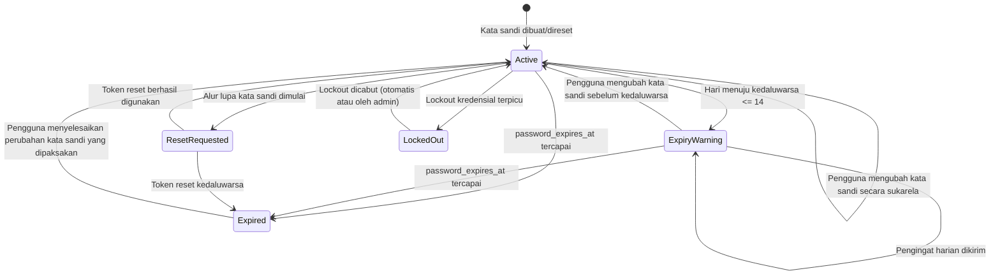
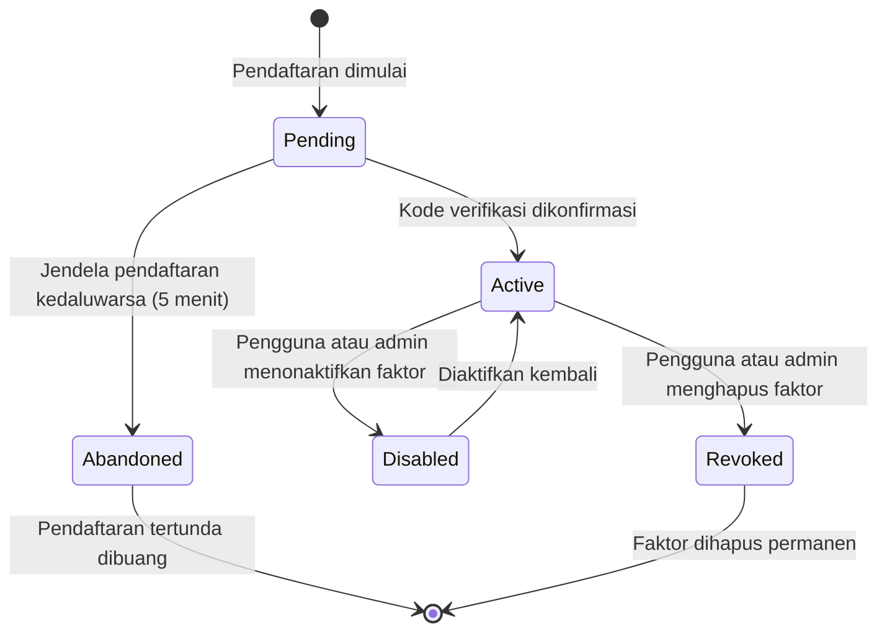
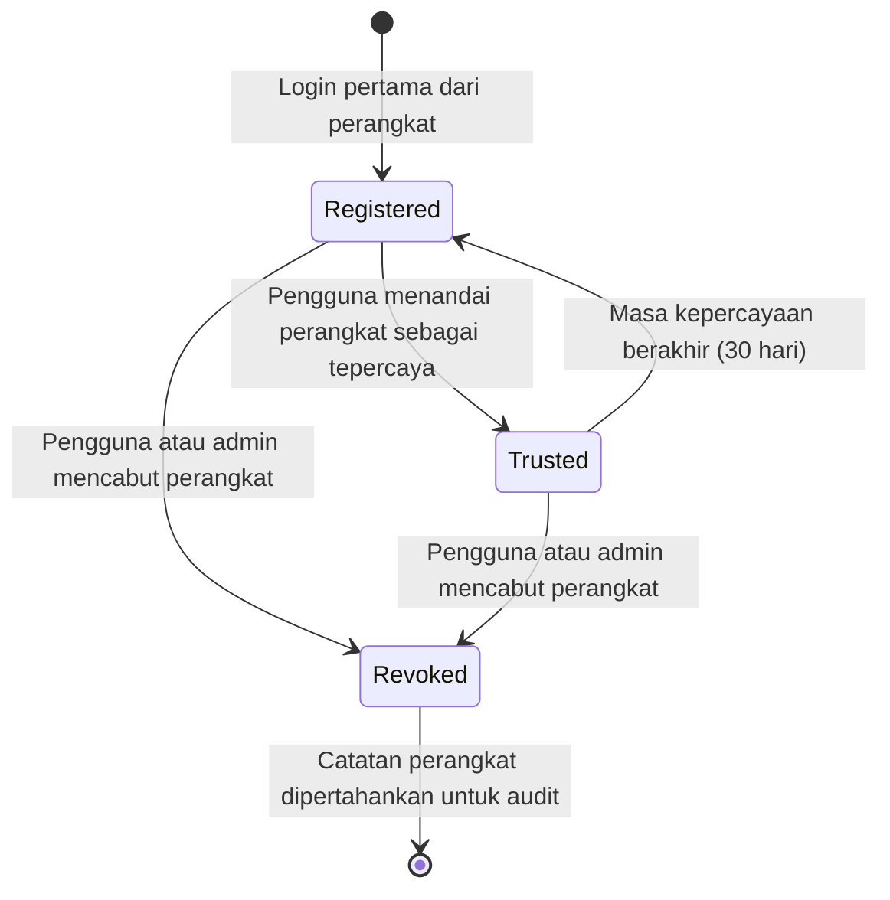
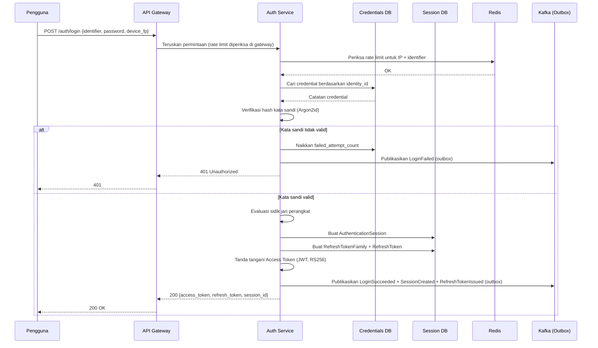
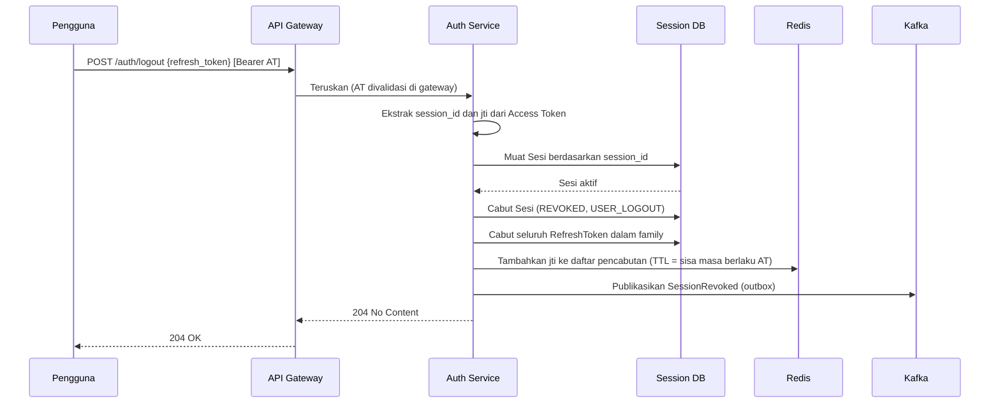
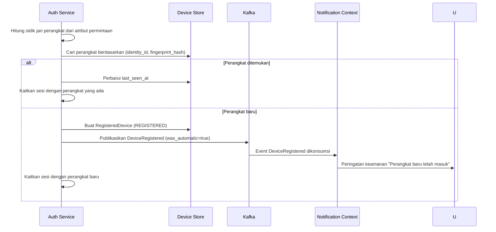
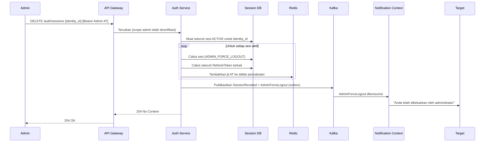

# Dokumen Kebutuhan Produk (Product Requirements Document)
## Modul Autentikasi — Platform Corporate Banking

**Versi Dokumen:** 1.0.0
**Klasifikasi:** Internal — Rahasia
**Status:** Draf untuk Peninjauan
**Tanggal:** 2026-06-30

---

# Daftar Isi

1. Ringkasan Eksekutif
2. Analisis Kapabilitas Bisnis
3. Penemuan Domain (Domain Discovery)
4. Bahasa Ubikuitas (Ubiquitous Language)
5. Bounded Context
6. Peta Konteks (Context Map)
7. Model Domain
8. Kebutuhan Fungsional
9. User Story & Kriteria Penerimaan
10. Arsitektur
11. Desain REST API
12. Desain Basis Data
13. Domain Event
14. State Machine
15. Sequence Diagram
16. Desain Keamanan
17. Kebutuhan Non-Fungsional
18. Risiko
19. Pengembangan di Masa Depan

---

# 1. Ringkasan Eksekutif

Modul Autentikasi adalah kapabilitas platform fondasional bagi Corporate Banking Ecosystem. Modul ini berdiri sebagai layanan mandiri yang dapat di-deploy secara independen dan bertanggung jawab atas satu perhatian yang didefinisikan secara sempit: **membuktikan bahwa suatu principal benar-benar adalah pihak yang diklaimnya, serta menerbitkan bukti yang dapat diverifikasi atas fakta tersebut kepada sistem hilir (downstream)**.

Setiap aplikasi dalam Corporate Banking Ecosystem — Bank Administration Portal, Corporate Portal, aplikasi Mobile Approval, dan Public API gateway — bergantung pada modul ini untuk menetapkan identitas pengguna dan sistem klien sebelum operasi bisnis apa pun diizinkan.

## Maksud Strategis

Autentikasi bukanlah sebuah fitur. Ia adalah kapabilitas infrastruktur yang berada pada jalur kritis setiap interaksi di dalam platform. Kegagalan pada autentikasi berarti kegagalan seluruh platform. Pelanggaran keamanan pada autentikasi berarti pelanggaran pada seluruh ekosistem perbankan. Hal ini menuntut modul dirancang dengan:

- **Nol toleransi terhadap kompromi keamanan** — setiap keputusan desain harus mengutamakan keamanan di atas kenyamanan
- **Ketersediaan operasional maksimum** — autentikasi harus lebih tangguh dibanding layanan hilir mana pun yang dilindunginya
- **Auditabilitas menyeluruh** — setiap peristiwa autentikasi harus dicatat dengan log yang imutabel dan tamper-evident
- **Kepatuhan pada standar protokol** — implementasi harus sesuai dengan OAuth 2.0 (RFC 6749), OpenID Connect 1.0, dan FIDO2 untuk menjamin interoperabilitas dan menghindari penguncian ke vendor tertentu (proprietary lock-in)

## Batas Ruang Lingkup

Modul ini **tidak** bertanggung jawab atas apa yang boleh dilakukan oleh pengguna yang telah terautentikasi. Otorisasi, peran, izin, lisensi produk, dan struktur korporasi merupakan milik bounded context yang terpisah. Modul Autentikasi menerbitkan token bertanda tangan kriptografis yang digunakan sistem hilir untuk mengambil keputusan otorisasi. Tugas modul autentikasi berakhir tepat pada saat token terverifikasi diterbitkan.

## Hasil Utama (Key Outcomes)

| Hasil | Ukuran |
|---|---|
| Mencegah akses tidak sah | Nol pelanggaran berbasis kredensial yang berhasil |
| Mendukung kepatuhan regulasi | Kepatuhan penuh terhadap PCI-DSS, ISO 27001, regulasi perbankan lokal |
| Memungkinkan akses sah tanpa hambatan | >99,5% alur login valid selesai dalam 3 detik |
| Menyediakan auditabilitas | 100% peristiwa autentikasi terekam dengan latensi di bawah satu detik |
| Mendukung ketangguhan operasional | SLA ketersediaan 99,99% |

---

# 2. Analisis Kapabilitas Bisnis

## 2.1 Mengapa Autentikasi Ada

Dalam konteks corporate banking, interaksi digital membawa konsekuensi finansial dan hukum yang signifikan. Instruksi pembayaran yang dieksekusi oleh pihak yang tidak terautentikasi atau menyamar dapat mengakibatkan kerugian finansial yang tidak dapat dipulihkan, sanksi regulator, kerusakan reputasi, dan tanggung jawab hukum.

Autentikasi ada untuk menyelesaikan satu masalah bisnis fundamental: **menetapkan keterikatan yang tepercaya antara klaim identitas digital dan identitas dunia nyata yang terverifikasi sebelum operasi bisnis yang berkonsekuensi diizinkan**.

Tanpa autentikasi:
- Setiap pemanggil dapat menyamar sebagai pengguna atau sistem mana pun
- Layanan hilir tidak memiliki identitas andal sebagai dasar keputusan otorisasi
- Jejak audit tidak dapat diatribusikan kepada pihak yang terverifikasi
- Kebutuhan regulasi untuk "know your user" tidak dapat dipenuhi

## 2.2 Kapabilitas Bisnis yang Disediakan

Autentikasi menyediakan kapabilitas platform berupa **Verifikasi Identitas dan Penerbitan Bukti**:

| Kapabilitas | Deskripsi |
|---|---|
| Verifikasi Kredensial | Memvalidasi bahwa suatu principal memiliki rahasia yang terkait dengan identitas yang diklaim |
| Tantangan Multi-Faktor | Menerapkan tantangan verifikasi berlapis yang meningkatkan tingkat jaminan (assurance level) |
| Penerbitan Bukti Autentikasi | Menghasilkan artefak yang dapat diverifikasi secara kriptografis (token) yang membuktikan keberhasilan verifikasi |
| Manajemen Siklus Hidup Sesi | Melacak dan mengatur durasi serta validitas status autentikasi yang terverifikasi |
| Penetapan Kepercayaan Perangkat | Mengikat sesi terautentikasi ke perangkat terverifikasi untuk mengurangi permukaan serangan |
| Manajemen Siklus Hidup Token | Menerbitkan, merotasi, memvalidasi, dan mencabut artefak bukti autentikasi |
| Pembentukan Jejak Audit | Memancarkan catatan peristiwa imutabel untuk setiap peristiwa autentikasi |
| Perlindungan Akun | Mendeteksi dan merespons serangan berbasis kredensial (brute force, credential stuffing) |

## 2.3 Masalah yang Diselesaikan

| Masalah | Solusi Autentikasi |
|---|---|
| Risiko penyamaran (impersonation) | Verifikasi kredensial multi-faktor |
| Eksploitasi pencurian kredensial | Token berumur pendek + rotasi refresh |
| Serangan brute force | Penguncian progresif + pembatasan laju (rate limiting) |
| Pembajakan sesi | Pengikatan perangkat + siklus hidup sesi yang aman |
| Ketidakpatuhan regulasi | Jejak audit lengkap + penegakan MFA |
| Ancaman orang dalam | Force logout + pencabutan sesi |
| Penyalahgunaan kredensial bersama | Registrasi per perangkat + deteksi anomali |

## 2.4 Kapabilitas yang Berada di Luar Autentikasi

| Kapabilitas | Bounded Context yang Tepat | Alasan |
|---|---|---|
| Apa yang boleh diakses pengguna | Authorization / Permission Context | Menentukan aksi yang diizinkan terpisah dari memverifikasi identitas |
| Peran apa yang dimiliki pengguna | Role Management Context | Penetapan peran adalah perhatian manajemen bisnis |
| Produk apa yang boleh dipakai korporasi | Product Licensing Context | Lisensi adalah perhatian komersial, bukan identitas |
| Manajemen profil pengguna | Identity Context | Data pengguna dimiliki oleh Identity, bukan Authentication |
| Struktur korporasi | Corporate Management Context | Hierarki organisasi adalah domain bisnis |
| Alur kerja persetujuan | Workflow Context | Persetujuan multi-pihak adalah perhatian transaksi |
| Pemrosesan pembayaran | Payment Context | Transaksi bisnis mengikuti identitas; ia bukan pembentuk identitas |

---

# 3. Penemuan Domain (Domain Discovery)

Domain Discovery dilakukan menggunakan metodologi Event Storming, dengan menelaah perjalanan autentikasi dari perspektif setiap aktor dalam Corporate Banking Ecosystem.

## 3.1 Aktor yang Teridentifikasi

| Aktor | Tipe | Pola Interaksi |
|---|---|---|
| Bank Administrator | Manusia | Peramban web melalui Bank Administration Portal |
| Corporate User | Manusia | Peramban web melalui Corporate Portal |
| Mobile Approver | Manusia | Aplikasi mobile native |
| API Client (Mesin) | Sistem | Alur OAuth2 Client Credentials |
| Layanan Hilir | Sistem | Introspeksi token |
| Sistem Fraud/Risiko | Sistem | Pelanggan event (subscriber) |
| Sistem Audit | Sistem | Pelanggan event (subscriber) |
| Notification Service | Sistem | Pelanggan event (subscriber) |

## 3.2 Domain Event Utama yang Ditemukan (Mentah)

1. Percobaan login dimulai
2. Kredensial dikirimkan
3. Kredensial terverifikasi / ditolak
4. Tantangan MFA dipicu
5. Kode MFA dikirimkan
6. MFA terverifikasi / ditolak
7. Autentikasi berhasil
8. Autentikasi gagal
9. Akun terkunci
10. Sesi dibuat
11. Token diterbitkan
12. Perangkat terdaftar
13. Perangkat dipercaya
14. Sesi kedaluwarsa (idle)
15. Sesi kedaluwarsa (absolut)
16. Sesi dicabut (diprakarsai pengguna)
17. Sesi dicabut (force logout)
18. Refresh token dirotasi
19. Refresh token dicabut
20. Perubahan kata sandi diminta
21. Kata sandi diubah
22. Reset kata sandi diminta
23. Reset kata sandi selesai
24. Kata sandi kedaluwarsa

## 3.3 Command yang Teridentifikasi

| Command | Dipicu Oleh |
|---|---|
| SubmitCredentials | Pengguna |
| SubmitMFACode | Pengguna |
| RegisterDevice | Pengguna |
| RevokeDevice | Pengguna / Admin |
| LogOut | Pengguna |
| ForceLogOut | Admin |
| RefreshAccessToken | Sistem Klien |
| RequestPasswordReset | Pengguna |
| ChangePassword | Pengguna |
| ResetPassword | Pengguna (dengan token) |
| RevokeRefreshToken | Sistem / Admin |
| IntrospectToken | Layanan Hilir |
| LockAccount | Sistem (kebijakan) |
| UnlockAccount | Admin |

---

# 4. Bahasa Ubikuitas (Ubiquitous Language)

**Authentication (Autentikasi)**
Proses ketika sistem memverifikasi bahwa suatu principal (pengguna atau sistem klien) memiliki kredensial yang terkait dengan identitas yang diklaim. Autentikasi menjawab pertanyaan: *"Apakah Anda benar-benar orang yang Anda katakan?"* Ia tidak menjawab *"Apa yang boleh Anda lakukan?"*

**Identity (Identitas)**
Representasi yang stabil dan unik atas entitas dunia nyata (orang atau sistem) di dalam platform. Identity dimiliki oleh bounded context Identity. Modul Autentikasi menerima referensi identitas tetapi tidak mengelola siklus hidup identitas.

**Credential (Kredensial)**
Rahasia atau kepemilikan yang dipegang principal yang dapat digunakan untuk membuktikan kendali atas suatu Identity. Contoh: kata sandi (faktor pengetahuan), kode OTP (faktor kepemilikan), biometrik (faktor bawaan), autentikator FIDO2 (faktor kepemilikan).

**Authentication Factor (Faktor Autentikasi)**
Kategori bukti yang digunakan untuk memverifikasi identitas:
- **Knowledge (Pengetahuan)** — sesuatu yang hanya diketahui pengguna (kata sandi, PIN)
- **Possession (Kepemilikan)** — sesuatu yang hanya dimiliki pengguna (ponsel, token perangkat keras, aplikasi autentikator)
- **Inherence (Bawaan)** — sesuatu yang melekat pada diri pengguna (biometrik: sidik jari, wajah)

**Multi-Factor Authentication (MFA)**
Alur autentikasi yang mensyaratkan keberhasilan verifikasi kredensial dari dua atau lebih faktor autentikasi yang berbeda.

**OTP (One-Time Password)**
Kode numerik sekali pakai dengan batas waktu yang dikirim ke kanal out-of-band terdaftar (mis. SMS atau email) atau dihasilkan oleh aplikasi TOTP.

**TOTP (Time-based One-Time Password)**
Algoritma OTP (RFC 6238) yang menghasilkan kode 6–8 digit menggunakan rahasia bersama (shared secret) dan jendela waktu saat ini.

**FIDO2 / WebAuthn**
Standar autentikasi modern yang tahan phishing dan menggunakan kriptografi kunci publik. Autentikator menyimpan kunci privat; server hanya menyimpan kunci publik.

**Passkey**
Kredensial FIDO2 yang disinkronkan antar perangkat pengguna melalui cloud keychain. Memungkinkan autentikasi tanpa kata sandi tanpa memerlukan token perangkat keras khusus.

**Session (Sesi)**
Catatan sisi server yang merepresentasikan status autentikasi aktif dan terverifikasi untuk suatu principal. Dibuat setelah autentikasi berhasil dan diakhiri saat logout, kedaluwarsa, atau pencabutan.

**Idle Timeout**
Kebijakan kedaluwarsa sesi yang mengakhiri sesi jika tidak terdeteksi aktivitas dalam durasi yang dikonfigurasi (default: 15 menit).

**Absolute Timeout**
Kebijakan kedaluwarsa sesi yang mengakhiri sesi setelah durasi maksimum tetap terlepas dari aktivitas (default: 8 jam sejak pembuatan).

**Access Token**
Kredensial berumur pendek yang ditandatangani secara kriptografis (JWT) dan diterbitkan setelah autentikasi berhasil. Membawa klaim tentang principal yang terautentikasi. Masa berlaku umum: 5–15 menit.

**Refresh Token**
Kredensial berumur panjang dan opak (opaque) yang memungkinkan klien memperoleh Access Token baru tanpa melakukan autentikasi ulang. Tunduk pada rotasi dan pencabutan. Masa berlaku umum: beberapa jam hingga beberapa hari.

**Refresh Token Rotation**
Teknik keamanan di mana setiap penggunaan Refresh Token menerbitkan Refresh Token baru dan membatalkan yang sebelumnya.

**Token Introspection**
Kapabilitas sisi server (RFC 7662) yang memungkinkan Resource Server memvalidasi Access Token dan mengambil klaimnya secara real-time.

**Authentication Attempt (Percobaan Autentikasi)**
Satu catatan bertanda waktu atas peristiwa pengiriman kredensial, yang merekam hasil, identitas principal, IP sumber, sidik jari perangkat, user agent, dan timestamp.

**Account Lockout (Penguncian Akun)**
Kebijakan keamanan yang menonaktifkan verifikasi kredensial untuk suatu identitas secara sementara atau permanen setelah sejumlah Percobaan Autentikasi gagal dalam jendela waktu tertentu.

**Device (Perangkat)**
Endpoint komputasi yang telah didaftarkan dan secara opsional dipercaya di dalam Modul Autentikasi.

**Trusted Device (Perangkat Tepercaya)**
Perangkat yang telah berhasil menyelesaikan verifikasi perangkat dan diberikan kepercayaan lebih tinggi oleh pengguna atau administrator.

**Device Fingerprint (Sidik Jari Perangkat)**
Kumpulan atribut stabil dan spesifik perangkat yang digabungkan menjadi sebuah hash untuk mengenali perangkat yang kembali.

**Password Policy (Kebijakan Kata Sandi)**
Sekumpulan aturan yang dapat dikonfigurasi yang mengatur karakteristik kata sandi yang dapat diterima beserta siklus hidupnya.

**Password History (Riwayat Kata Sandi)**
Catatan hash kata sandi yang pernah digunakan, dipakai untuk mencegah penggunaan ulang kredensial.

**Authentication Assurance Level (AAL)**
Ukuran terstandardisasi (NIST SP 800-63B) atas tingkat keyakinan bahwa suatu peristiwa autentikasi adalah asli:
- **AAL1** — Faktor tunggal (hanya kata sandi)
- **AAL2** — Multi-faktor (kata sandi + OTP/TOTP)
- **AAL3** — Multi-faktor berbasis perangkat keras (FIDO2 dengan autentikator perangkat keras)

**Force Logout**
Tindakan administratif yang segera membatalkan seluruh Sesi aktif dan Refresh Token untuk suatu identitas.

---

# 5. Bounded Context

## 5.1 Authentication Bounded Context: Definisi

**Authentication Bounded Context** adalah domain mandiri yang bertanggung jawab untuk:

1. Memverifikasi bahwa suatu principal memiliki kredensial valid untuk identitas yang diklaim
2. Mengelola siklus hidup kredensial tersebut (kata sandi, faktor MFA)
3. Menerbitkan bukti autentikasi yang dapat diverifikasi secara kriptografis (Access Token, Refresh Token)
4. Mengelola siklus hidup sesi dan token autentikasi
5. Mencatat seluruh peristiwa autentikasi untuk kepentingan audit dan keamanan
6. Menegakkan kebijakan keamanan autentikasi (lockout, rate limiting, penegakan MFA)
7. Mengelola registrasi perangkat dan siklus hidup kepercayaannya

## 5.2 Di Dalam Authentication Bounded Context

| Perhatian | Alasan |
|---|---|
| Penyimpanan dan verifikasi kredensial | Tanggung jawab utama Authentication |
| Hashing, riwayat, dan kebijakan kata sandi | Siklus hidup kredensial berada di sini |
| Pendaftaran dan verifikasi faktor MFA | Verifikasi faktor kedua adalah perhatian autentikasi |
| Pembuatan, kedaluwarsa, dan pencabutan sesi | Sesi adalah representasi dari status terautentikasi |
| Penerbitan dan penandatanganan Access Token | Token adalah bukti hasil autentikasi |
| Siklus hidup Refresh Token | Refresh Token memperpanjang bukti autentikasi |
| Registrasi dan kepercayaan perangkat | Kepercayaan perangkat memengaruhi postur risiko autentikasi |
| Pencatatan percobaan login | Catatan percobaan mendorong lockout dan deteksi fraud |
| Penegakan kebijakan penguncian akun | Respons langsung terhadap autentikasi gagal |
| Pemancaran peristiwa autentikasi | Authentication menghasilkan domain event untuk konsumsi hilir |

## 5.3 Di Luar Authentication Bounded Context

| Perhatian | Mengapa Berada di Tempat Lain |
|---|---|
| Profil pengguna (nama, email, telepon) | Dimiliki oleh Identity Context |
| Penetapan peran | Peran adalah perhatian otorisasi bisnis |
| Evaluasi izin | Dievaluasi oleh layanan hilir menggunakan klaim dalam token |
| Struktur korporasi | Hierarki organisasi adalah domain bisnis |
| Pemeriksaan lisensi produk | Hak komersial bukan bagian dari verifikasi identitas |
| Perutean persetujuan | Workflow adalah proses bisnis |
| Pengiriman notifikasi OTP/Email | Dikirim oleh Notification Context |
| Penilaian fraud (fraud scoring) | Fraud adalah domain risiko; Authentication memancarkan event yang dilanggan Fraud |

## 5.4 Justifikasi Batasan

Keputusan arsitektural terpenting adalah pemisahan antara **Authentication** dan **Identity**. Menggabungkan keduanya menciptakan kopling yang menghambat penskalaan independen, mencampuradukkan dua perhatian berbeda dengan laju perubahan yang berbeda, dan membuat mustahil mengganti mekanisme autentikasi tanpa memengaruhi data pengguna.

---

# 6. Peta Konteks (Context Map)

## 6.1 Gambaran Relasi

```
                           ┌──────────────────────────┐
                           │   Authentication Module   │
                           │    (Core Domain)          │
                           └──────────┬───────────────┘
                                      │
          ┌───────────────────────────┼───────────────────────────────┐
          │                           │                               │
          ▼                           ▼                               ▼
  ┌───────────────┐         ┌─────────────────┐            ┌────────────────┐
  │   Identity    │         │   Notification  │            │     Audit      │
  │   Context     │         │   Context       │            │   Context      │
  │ (Upstream)    │         │ (Downstream)    │            │ (Downstream)   │
  └───────────────┘         └─────────────────┘            └────────────────┘
```

## 6.2 Relasi Konteks Secara Rinci

### Authentication ↔ Identity Context
**Relasi:** Customer/Supplier (Identity berada di Upstream). Authentication melakukan kueri ke Identity untuk memeriksa keberadaan/status aktif melalui Anti-Corruption Layer. Authentication mendefinisikan value object `IdentityRef` miliknya sendiri; perubahan skema Identity hanya memengaruhi adapter ACL.

### Authentication → Notification Context
**Relasi:** Authentication berada di Upstream. Event asinkron memicu pengiriman notifikasi (OTP, tautan reset kata sandi, peringatan keamanan). Authentication tidak pernah menunggu Notification — kegagalan notifikasi tidak menyebabkan autentikasi gagal.

### Authentication → Audit Context
**Relasi:** Authentication berada di Upstream. Seluruh peristiwa autentikasi dipancarkan secara asinkron melalui Kafka (pengiriman terjamin lewat pola outbox). Audit Context menangani penyimpanan imutabel jangka panjang dan pelaporan kepatuhan.

### Authentication ↔ Corporate Context
**Relasi:** Corporate berada di Upstream. Authentication melakukan kueri ke Corporate untuk kebijakan MFA tingkat korporasi pada saat login. Kebijakan di-cache (TTL pendek). Jika Corporate tidak tersedia, kebijakan paling ketat diterapkan (fail secure).

### Authentication ↔ Product Licensing Context
**Relasi:** Product Licensing berada di Upstream. Lisensi diperiksa pada saat pendaftaran MFA (bukan saat login) untuk menentukan ketersediaan faktor premium. Ini menghindari ketergantungan runtime yang kaku saat login.

### Authentication → Fraud/Risk Context
**Relasi:** Authentication berada di Upstream. Authentication memancarkan event `LoginSucceeded`, `LoginFailed`, `AccountLocked`, `NewDeviceRegistered`. Fraud Context dapat merespons dengan perintah Force Logout atau penguncian akun (command masuk dari Fraud).

---

# 7. Model Domain

## 7.1 Aggregate

### Aggregate 1: `AuthenticationSession`
Melindungi invarian: sebuah sesi tidak bisa sekaligus aktif dan kedaluwarsa; sesi yang telah dicabut tidak dapat diaktifkan kembali; waktu kedaluwarsa bersifat imutabel setelah pembuatan.

**Berisi:** Session ID, Identity Reference, Device Reference, AAL, Session Status (`ACTIVE`/`EXPIRED`/`REVOKED`), Timestamp Pembuatan, Timestamp Aktivitas Terakhir, Idle Timeout, Absolute Expiry, Faktor MFA yang Digunakan.

### Aggregate 2: `CredentialAggregate`
Melindungi invarian: jumlah percobaan gagal selalu konsisten dengan status lockout; kedalaman riwayat kata sandi tidak pernah melebihi maksimum kebijakan; kredensial yang terkunci tidak dapat diverifikasi.

**Berisi:** Credential ID, Identity Reference, Password Hash, Password Salt, Algoritma/Versi Kata Sandi, Password Created/Expires At, flag Force Password Change, Jumlah Percobaan Gagal, Status Lockout (`UNLOCKED`/`LOCKED_TEMPORARY`/`LOCKED_PERMANENT`), Locked Until, Password History (koleksi entity).

### Aggregate 3: `MFAFactor`
Melindungi invarian: faktor dalam status `PENDING` tidak dapat digunakan untuk verifikasi; recovery code bersifat sekali pakai dan harus ditandai terpakai secara atomik.

**Berisi:** Factor ID, Identity Reference, Tipe Faktor (`TOTP`/`SMS_OTP`/`FIDO2`/`PASSKEY`), Status Pendaftaran (`PENDING`/`ACTIVE`/`DISABLED`/`REVOKED`), Factor Secret atau Public Key, FIDO2 Counter, Recovery Code (koleksi entity).

### Aggregate 4: `RegisteredDevice`
Melindungi invarian: perangkat yang dicabut tidak dapat dipercaya; sidik jari perangkat bersifat imutabel setelah registrasi; masa berlaku kepercayaan selalu berada di masa depan pada saat ditetapkan.

**Berisi:** Device ID, Identity Reference, Device Fingerprint, Device Name, Status Kepercayaan (`REGISTERED`/`TRUSTED`/`REVOKED`), Trust Expires At, Registered At, Last Seen At, IP Registrasi.

### Aggregate 5: `RefreshTokenFamily`
Melindungi invarian: hanya satu token dalam satu family yang boleh `ACTIVE` pada satu waktu; begitu suatu family berstatus `COMPROMISED`, seluruh token harus `REVOKED`; sebuah token hanya dapat digunakan satu kali.

**Berisi:** Family ID, Session Reference, Identity Reference, Status Family (`ACTIVE`/`REVOKED`/`COMPROMISED`), Token Chain (koleksi entity `RefreshToken` terurut).

## 7.2 Entity (di dalam Aggregate)

| Entity | Aggregate | Atribut Kunci |
|---|---|---|
| `PasswordHistoryEntry` | CredentialAggregate | hash, created_at |
| `RecoveryCode` | MFAFactor | code_hash, is_used, used_at |
| `RefreshToken` | RefreshTokenFamily | token_hash, status, issued_at, expires_at, used_at |

## 7.3 Value Object

| Value Object | Digunakan Di | Mengapa Berupa Value Object |
|---|---|---|
| `IdentityRef` | Semua aggregate | Referensi opak; kesetaraan berdasarkan nilai |
| `PasswordHash` | CredentialAggregate | Mengenkapsulasi logika hashing Argon2id |
| `DeviceFingerprint` | RegisteredDevice | Dihitung dari atribut; imutabel |
| `AuthenticationAssuranceLevel` | AuthenticationSession | Seperti enum; kesetaraan berdasarkan nilai |
| `TokenClaims` | Domain Service | Kumpulan klaim JWT yang imutabel |
| `IPAddress` | Login Attempt | Imutabel; kesetaraan berdasarkan nilai |

## 7.4 Domain Service

| Service | Tanggung Jawab |
|---|---|
| `CredentialVerificationService` | Memverifikasi kata sandi yang dikirimkan terhadap kredensial tersimpan melalui port hashing |
| `MFAVerificationService` | Memverifikasi assertion OTP/TOTP/FIDO2; mengelola perbandingan jendela waktu; memvalidasi counter FIDO2 |
| `TokenIssuanceService` | Membuat dan menandatangani Access Token (JWT) secara kriptografis |
| `SessionPolicyEnforcementService` | Mengevaluasi idle dan absolute timeout saat refresh dan akses sumber daya |
| `LockoutPolicyService` | Mengevaluasi apakah suatu percobaan gagal harus memicu lockout |
| `PasswordPolicyService` | Memvalidasi kata sandi yang diajukan terhadap kebijakan aktif |

## 7.5 Repository (Port)

| Repository Port | Operasi |
|---|---|
| `AuthenticationSessionRepository` | Find by ID, Find active by identity, Save, Delete |
| `CredentialRepository` | Find by identity_id, Save |
| `MFAFactorRepository` | Find by identity_id dan type, Find active by identity, Save |
| `RegisteredDeviceRepository` | Find by device_id, Find by identity_id dan fingerprint, Save |
| `RefreshTokenFamilyRepository` | Find by token_hash, Find by session_id, Save |
| `LoginAttemptRepository` | Save, Count kegagalan per identitas dalam jendela waktu |
---

# 8. Kebutuhan Fungsional

## 8.1 Login

**FR-LOGIN-001: Autentikasi Username/Kata Sandi**
Menerima username dan kata sandi, memverifikasi terhadap hash tersimpan menggunakan Argon2id, dan mengembalikan hasil autentikasi.

**FR-LOGIN-002: Autentikasi Email/Kata Sandi (Siap untuk Masa Depan)**
Arsitektur harus mendukung email sebagai pengenal login tanpa perubahan skema. Pencarian kredensial harus agnostik terhadap tipe pengenal. Implementasi ditunda ke Fase 2.

**FR-LOGIN-003: Penanganan Login Gagal**
- Menaikkan penghitung percobaan gagal pada setiap kegagalan
- Mengembalikan pesan galat generik yang tidak membedakan antara "pengguna tidak ditemukan" dan "kata sandi salah"
- Menerapkan kebijakan lockout yang dapat dikonfigurasi setelah N kegagalan berturut-turut dalam jendela waktu (default: 5 kegagalan dalam 15 menit)
- Memancarkan domain event `LoginFailed`

**FR-LOGIN-004: Penguncian Akun**
Dua mode penguncian:
- **Temporary Lockout:** Terkunci selama durasi yang dikonfigurasi (default: 30 menit), lalu otomatis terbuka
- **Permanent Lockout:** Terkunci tanpa batas waktu; memerlukan administrator untuk membukanya

Kebijakan eskalasi (dapat dikonfigurasi): Lockout pertama → Temporary (30 menit); Kedua → Temporary (2 jam); Ketiga → Permanent.

**FR-LOGIN-005: Audit Login**
Setiap percobaan login (berhasil maupun gagal) harus dipersistensi sebagai catatan `LoginAttempt` yang berisi: identity_id, timestamp, outcome, failure_reason, ip_address, user_agent, device_fingerprint, session_id (bila berhasil).

**FR-LOGIN-006: Kebijakan Sesi Simultan**
Kebijakan yang dapat dikonfigurasi: Izinkan semua sesi bersamaan; Batasi N (yang terlama dibatalkan); Sesi tunggal (sesi sebelumnya dicabut saat login baru).

## 8.2 Autentikasi Multi-Faktor

**FR-MFA-001: Tipe Faktor MFA**
- SMS OTP (Fase 1)
- TOTP melalui aplikasi autentikator (Fase 1)
- FIDO2/WebAuthn (Fase 1 untuk web, Fase 2 untuk mobile)
- Passkey (Fase 2)

**FR-MFA-002: Pendaftaran TOTP**
1. Membangkitkan shared secret acak kriptografis sepanjang 20 byte
2. Meng-encode sebagai Base32, menampilkan sebagai kode QR (URI otpauth://)
3. Mensyaratkan kode TOTP valid sebelum pendaftaran dikonfirmasi
4. Menyimpan secret dalam keadaan terenkripsi saat disimpan (at rest)
5. Membangkitkan dan menampilkan 10 recovery code sekali pakai
6. Mengubah status faktor menjadi `ACTIVE`

**FR-MFA-003: Verifikasi TOTP**
- Menerima kode 6 digit
- Memvalidasi terhadap jendela waktu saat ini dan ±1 (jendela 30 detik; mengizinkan selisih jam 30 detik)
- Menolak kode yang telah dipakai sebelumnya dalam jendela waktu yang sama (pencegahan replay)
- Melacak kegagalan TOTP berturut-turut dan menerapkan kebijakan lockout

**FR-MFA-004: SMS OTP**
- Membangkitkan kode numerik 6 digit acak kriptografis
- Menyimpan OTP dalam bentuk hash dengan masa berlaku (default: 5 menit)
- Mengirim melalui Notification Context (asinkron)
- Sekali pakai; dibatalkan saat digunakan atau kedaluwarsa
- Batas laju: 3 pengiriman OTP per jendela 10 menit per identitas

**FR-MFA-005: Pendaftaran FIDO2/WebAuthn**
- Mengikuti spesifikasi W3C WebAuthn Level 2
- Mendukung autentikator platform dan roaming
- Menyimpan public key kredensial, credential ID, dan AAGUID
- Menginisialisasi counter ke 0 saat pendaftaran
- Mensyaratkan flag user presence (UP); secara opsional flag user verification (UV)

**FR-MFA-006: Verifikasi FIDO2/WebAuthn**
- Membangkitkan challenge sisi server (minimum 16 byte acak)
- Memvalidasi: rpIdHash, flags (UP wajib), counter (harus > counter tersimpan)
- Memvalidasi client data JSON: challenge cocok, origin cocok, type adalah `webauthn.get`
- Memperbarui counter tersimpan saat verifikasi berhasil

**FR-MFA-007: Pemulihan MFA**
- 10 recovery code per faktor (8 karakter alfanumerik, disimpan dalam bentuk hash)
- Setiap kode bersifat sekali pakai
- Ketika tersisa kurang dari 3 kode, pengguna diminta membangkitkan ulang
- Penggunaan recovery code memancarkan event `MFARecoveryCodeUsed`

**FR-MFA-008: Siklus Hidup Pendaftaran MFA**
Status: `PENDING` → `ACTIVE` → `DISABLED` atau `REVOKED`

**FR-MFA-009: Penegakan Kebijakan MFA**
Kebijakan tingkat korporasi dapat mewajibkan MFA. Jika wajib dan pengguna belum memiliki faktor aktif, mereka harus mendaftar sebelum menyelesaikan login.

## 8.3 Manajemen Sesi

**FR-SESSION-001: Pembuatan Sesi**
Setelah autentikasi berhasil, buat `AuthenticationSession` dengan session ID unik, referensi identitas, referensi perangkat, AAL, timestamp, idle timeout, absolute expiry, dan status `ACTIVE`.

**FR-SESSION-002: Kedaluwarsa Sesi**
Baik idle timeout (default: 15 menit) maupun absolute timeout (default: 8 jam) ditegakkan secara independen. Kedaluwarsa dievaluasi secara lazy (saat refresh token) dan eager (background sweeper).

**FR-SESSION-003: Pencabutan Sesi**
Dapat dicabut seketika melalui: logout yang diprakarsai pengguna, force logout oleh admin, atau peristiwa keamanan. Pencabutan langsung membatalkan seluruh Refresh Token terkait.

**FR-SESSION-004: Kueri Sesi**
Pengguna terautentikasi dapat melihat daftar sesi aktif miliknya. Administrator dapat melihat dan mencabut sesi untuk identitas mana pun.

**FR-SESSION-005: Pembaruan Aktivitas Sesi**
Pada setiap keberhasilan refresh access token, perbarui `last_activity_at` untuk mereset penghitung idle timeout.

## 8.4 Manajemen Perangkat

**FR-DEVICE-001: Registrasi Perangkat**
Menangkap sidik jari perangkat saat login. Mencocokkan dengan perangkat terdaftar yang ada. Jika tidak ada yang cocok, daftarkan perangkat baru secara otomatis.

**FR-DEVICE-002: Peringatan Perangkat Baru**
Memancarkan event `NewDeviceDetected` pada perangkat yang tidak dikenali. Notification Context mengirimkan peringatan keamanan kepada pengguna.

**FR-DEVICE-003: Perangkat Tepercaya**
Pengguna dapat menandai perangkat sebagai Trusted. Kepercayaan memiliki masa berlaku (default: 30 hari). Perangkat tepercaya dapat memenuhi syarat untuk frekuensi step-up MFA yang lebih rendah sesuai kebijakan.

**FR-DEVICE-004: Pencabutan Perangkat**
Pengguna atau administrator dapat mencabut sebuah perangkat. Pencabutan langsung membatalkan seluruh sesi yang terkait dengan perangkat tersebut.

**FR-DEVICE-005: Daftar Perangkat**
Pengguna terautentikasi dapat melihat seluruh perangkat terdaftar dan mencabut salah satunya.

## 8.5 Manajemen Kata Sandi

**FR-PWD-001: Kebijakan Kata Sandi** (dapat dikonfigurasi per korporasi)
- Panjang minimum: 12 karakter
- Harus memuat: huruf besar, huruf kecil, angka, karakter khusus
- Panjang maksimum: 128 karakter (pencegahan DoS)
- Daftar blokir kata sandi umum (minimum 100.000 entri)
- Username tidak boleh terkandung di dalam kata sandi

**FR-PWD-002: Riwayat Kata Sandi**
Mencegah penggunaan ulang N kata sandi terakhir (default: 12). Entri riwayat hanya menyimpan hash.

**FR-PWD-003: Kedaluwarsa Kata Sandi**
Default: 90 hari (bank admin), 180 hari (pengguna korporasi). Peringatan pada 14, 7, 3, dan 1 hari sebelum kedaluwarsa. Saat kedaluwarsa, pengguna dipaksa mengubah kata sandi sebelum mengakses sumber daya terlindungi.

**FR-PWD-004: Lupa Kata Sandi**
1. Pengguna mengirimkan pengenal; sistem selalu mengembalikan respons yang sama (mencegah enumerasi)
2. Jika identitas ada: bangkitkan token reset sekali pakai berumur pendek (TTL 60 menit)
3. Memancarkan event `PasswordResetRequested` → Notification Context mengirim tautan reset

**FR-PWD-005: Reset Kata Sandi (melalui Reset Token)**
1. Memvalidasi token (ada, belum kedaluwarsa, belum dipakai)
2. Memvalidasi kata sandi baru terhadap kebijakan dan riwayat
3. Memperbarui hash kata sandi; menandai token sebagai terpakai
4. Mencabut seluruh sesi aktif
5. Memancarkan `PasswordResetCompleted`

**FR-PWD-006: Ubah Kata Sandi (Terautentikasi)**
1. Memverifikasi kata sandi saat ini
2. Memvalidasi kata sandi baru terhadap kebijakan dan riwayat
3. Memperbarui hash; menambahkan kata sandi lama ke riwayat
4. Mencabut sesi lain (dapat dikonfigurasi; default: cabut semua kecuali sesi saat ini)
5. Memancarkan `PasswordChanged`

**FR-PWD-007: Reset Kata Sandi yang Diprakarsai Admin**
Administrator dapat memaksa reset kata sandi untuk identitas mana pun. Pengguna harus menetapkan kata sandi baru pada login berikutnya.

## 8.6 Manajemen Token

**FR-TOKEN-001: Struktur Access Token**
JWT (RFC 7519) dengan RS256. Klaim: `iss`, `sub` (identity_id), `aud`, `iat`, `exp` (default 15 menit), `jti`, `session_id`, `aal`, `device_id`, `scope`, `corporate_id`.

**FR-TOKEN-002: Penandatanganan Access Token**
RS256 (RSA minimum 2048-bit; RSA 4096-bit lebih disukai). Kunci publik di `/.well-known/jwks.json`. Rotasi kunci setiap 90 hari. Kunci privat berada di HSM/Vault.

**FR-TOKEN-003: Refresh Token**
Opak, acak kriptografis (minimum 32 byte). Hanya hash SHA-256 yang disimpan di sisi server. Masa berlaku: 24 jam (web), 7 hari (mobile). Terikat pada sesi.

**FR-TOKEN-004: Rotasi Refresh Token**
Saat penukaran: validasi token, validasi sesi, tandai token lama sebagai `USED`, bangkitkan token baru, terbitkan Access Token baru.
**Deteksi penggunaan ulang:** Jika token berstatus `USED` dikirimkan, cabut seluruh token family dan sesi terkait. Memancarkan `RefreshTokenFamilyCompromised`.

**FR-TOKEN-005: Pencabutan Token**
Endpoint RFC 7009. Pencabutan Access Token: tambahkan `jti` ke daftar pencabutan di Redis (TTL = sisa masa berlaku). Refresh Token: perbarui status di PostgreSQL.

**FR-TOKEN-006: Introspeksi Token**
Endpoint RFC 7662. Resource server mengirimkan token; menerima status aktif dan klaimnya.

**FR-TOKEN-007: Endpoint JWKS**
Mempublikasikan kunci publik penandatanganan di `/.well-known/jwks.json` (RFC 7517).

---

# 9. User Story & Kriteria Penerimaan

## US-001: Login Standar
**Sebagai** Corporate User, **saya ingin** masuk menggunakan username dan kata sandi, **agar** saya dapat mengakses Corporate Portal.

**Kriteria Penerimaan:**
- Kredensial valid mengembalikan Access Token dan Refresh Token dalam waktu 3 detik
- Kredensial tidak valid mengembalikan galat generik (tanpa membedakan username/kata sandi)
- 5 kegagalan berturut-turut dalam 15 menit memicu penguncian akun
- Setiap percobaan dicatat dalam log audit beserta IP, user agent, dan timestamp

## US-002: Login dengan MFA Wajib
**Sebagai** Bank Administrator, **saya ingin** menyelesaikan MFA setelah memasukkan kata sandi, **agar** akun istimewa saya terlindungi oleh faktor kedua.

**Kriteria Penerimaan:**
- Kata sandi benar + kebijakan MFA aktif → sistem menerbitkan MFA challenge token (bukan access token penuh)
- Kode TOTP valid → Access Token penuh dengan AAL2
- Sesi MFA kedaluwarsa (jendela 10 menit) → tantangan MFA ditolak; pengguna harus mengulang login
- Tidak ada faktor MFA aktif + MFA wajib → pengguna diarahkan ke pendaftaran

## US-003: Pemulihan dari Penguncian Akun
**Sebagai** pengguna yang terkunci sementara, **saya ingin** dibuka kuncinya secara otomatis setelah periode penguncian, **agar** saya dapat melanjutkan akses tanpa campur tangan administrator.

**Kriteria Penerimaan:**
- Penguncian sementara dibuka otomatis setelah durasi yang dikonfigurasi
- Penguncian permanen memerlukan tindakan administrator
- Penghitung percobaan gagal direset saat kunci dibuka
- Peristiwa pembukaan kunci dicatat dalam log audit

## US-004: Pendaftaran TOTP
**Sebagai** Corporate User, **saya ingin** mendaftarkan aplikasi autentikator saya, **agar** akun saya terlindungi oleh faktor kedua.

**Kriteria Penerimaan:**
- Kode QR ditampilkan dengan URI provisioning OTP yang valid
- Pendaftaran hanya dikonfirmasi dengan mengirimkan kode TOTP valid dari QR tersebut
- 10 recovery code sekali pakai ditampilkan saat pendaftaran berhasil
- Recovery code dapat digunakan jika perangkat hilang

## US-005: Registrasi FIDO2
**Sebagai** Bank Administrator, **saya ingin** mendaftarkan security key, **agar** saya terlindungi dari serangan phishing.

**Kriteria Penerimaan:**
- Alur registrasi FIDO2 dimulai dari pengaturan keamanan
- Sistem menantang key dengan challenge acak yang dibangkitkan server
- Respons yang berhasil menyimpan kunci publik dan mengaktifkan faktor
- Faktor muncul dalam daftar faktor MFA aktif

## US-006: Lupa Kata Sandi
**Sebagai** pengguna yang lupa kata sandinya, **saya ingin** meresetnya melalui tautan email, **agar** saya dapat memperoleh kembali akses.

**Kriteria Penerimaan:**
- Mengirim pengenal apa pun selalu menampilkan "jika akun tersebut ada, Anda akan menerima email"
- Tautan reset bersifat sekali pakai dan berlaku selama 60 menit
- Kata sandi baru harus memenuhi kebijakan kata sandi
- Seluruh sesi lain dibatalkan setelah reset

## US-007: Pemaksaan Ubah Kata Sandi oleh Admin
**Sebagai** Bank Administrator, **saya ingin** memaksa pengguna mengubah kata sandinya pada login berikutnya.

**Kriteria Penerimaan:**
- Pengguna tetap dapat login dengan kata sandi saat ini setelah tindakan admin
- Pengguna diarahkan ke layar ubah kata sandi sebelum mengakses sumber daya apa pun
- Pengguna tidak dapat melewati pemaksaan perubahan tersebut
- Tindakan dicatat dalam log audit

## US-008: Peringatan Perangkat Baru
**Sebagai** Corporate User, **saya ingin** menerima peringatan ketika akun saya login dari perangkat baru.

**Kriteria Penerimaan:**
- Login dari sidik jari perangkat yang belum terdaftar → notifikasi keamanan dalam 60 detik
- Notifikasi memuat nama perangkat, IP, dan perkiraan lokasi
- Pengguna dapat mencabut perangkat baru langsung dari notifikasi

## US-009: Dasbor Manajemen Sesi
**Sebagai** Corporate User, **saya ingin** melihat dan mengelola seluruh sesi aktif saya.

**Kriteria Penerimaan:**
- Daftar sesi aktif beserta nama perangkat, aktivitas terakhir, dan IP
- Setiap sesi individual dapat dicabut
- Pencabutan langsung membatalkan token terkait
- Sesi saat ini teridentifikasi dengan jelas

---

# 10. Arsitektur

## 10.1 Gaya Arsitektur
Hexagonal Architecture (Ports and Adapters) + Clean Architecture. Microservice yang dapat di-deploy secara independen.

```
┌────────────────────────────────────────────────────────────────────┐
│                    Authentication Service                          │
│                                                                    │
│  ┌──────────────┐    ┌────────────────────────────────────────┐   │
│  │   Primary    │    │              Application               │   │
│  │  Adapters    │───▶│               Layer                    │   │
│  │  (Inbound)   │    │   (Use Cases / Application Services)   │   │
│  │              │    └────────────────┬───────────────────────┘   │
│  │ - REST API   │                     │                            │
│  │ - gRPC       │    ┌────────────────▼───────────────────────┐   │
│  │ - Event      │    │               Domain                   │   │
│  │   Consumer   │    │                Layer                   │   │
│  └──────────────┘    │   (Aggregates, Domain Services,        │   │
│                      │    Repositories [Ports], Events)       │   │
│  ┌──────────────┐    └────────────────┬───────────────────────┘   │
│  │  Secondary   │                     │                            │
│  │  Adapters    │◀───────────────────┘                            │
│  │  (Outbound)  │                                                  │
│  │              │                                                  │
│  │ - PostgreSQL │                                                  │
│  │ - Redis      │                                                  │
│  │ - Kafka      │                                                  │
│  │ - Vault      │                                                  │
│  │ - Identity   │                                                  │
│  │   Client     │                                                  │
│  └──────────────┘                                                  │
└────────────────────────────────────────────────────────────────────┘
```

## 10.2 Tumpukan Teknologi

| Lapisan | Teknologi | Alasan |
|---|---|---|
| Runtime | JVM (Java 21 LTS) atau Go 1.22+ | JVM: ekosistem keamanan/kriptografi yang kaya; Go: performa, memori rendah |
| Framework | Spring Boot 3 (Java) atau stdlib/chi (Go) | Spring Boot untuk JVM; chi untuk minimalisme Go |
| Basis Data | PostgreSQL 16 | Kepatuhan ACID, ekstensi enkripsi yang kuat |
| Cache / Sesi | Redis 7 (Cluster) | Validasi token dan daftar pencabutan berlatensi rendah |
| Message Broker | Apache Kafka | Pengiriman domain event yang durabel dan terurut |
| Manajemen Rahasia | HashiCorp Vault | Integrasi HSM, rotasi rahasia, kredensial dinamis |
| Service Mesh | Istio | mTLS, manajemen trafik, observabilitas |
| Kontainer | Docker + Kubernetes | Deployment cloud-native, penskalaan horizontal |
| Observabilitas | OpenTelemetry + Grafana Stack | Distributed tracing, metrik, agregasi log |

## 10.3 Desain Statelessness

Seluruh pod bersifat stateless. State dieksternalisasi:
- **State sesi** → PostgreSQL + Redis (Redis meng-cache sesi yang aktif/hot)
- **Daftar pencabutan token** → Redis (TTL menyesuaikan masa berlaku token)
- **State refresh token** → PostgreSQL (durabel)
- **Kunci penandatanganan** → Vault (diambil saat startup, di-cache di memori)
- **Penghitung rate limit** → Redis

## 10.4 Pola Outbox untuk Publikasi Event yang Andal

1. Domain event ditulis ke tabel `outbox` dalam transaksi basis data yang sama dengan perubahan state aggregate
2. Proses relay latar belakang membaca outbox dan mempublikasikan ke Kafka
3. Setelah acknowledgment Kafka berhasil, entri outbox ditandai `PUBLISHED`

Hal ini menjamin pengiriman at-least-once tanpa transaksi terdistribusi.

---

# 11. Desain REST API

Seluruh API: JSON, diversikan di bawah `/api/v1/auth`, wajib HTTPS. Galat mengikuti RFC 7807.

## Respons Galat Standar

```json
{
  "type": "https://auth.bank.com/errors/invalid-credentials",
  "title": "Invalid Credentials",
  "status": 401,
  "detail": "The provided credentials are incorrect.",
  "instance": "/api/v1/auth/login",
  "trace_id": "a3f9b2c1-1234-5678-abcd-ef1234567890"
}
```

## 11.1 API Login

### POST /api/v1/auth/login

**Request:**
```json
{
  "identifier": "john.smith",
  "password": "S3cur3P@ssword!",
  "device_fingerprint": {
    "user_agent": "Mozilla/5.0...",
    "screen_resolution": "1920x1080",
    "timezone": "Asia/Jakarta",
    "language": "en-US",
    "platform": "Win32"
  },
  "client_id": "corporate-portal"
}
```

**Response 200 — MFA tidak diperlukan:**
```json
{
  "authentication_result": "COMPLETED",
  "access_token": "eyJhbGciOiJSUzI1NiIsInR...",
  "token_type": "Bearer",
  "expires_in": 900,
  "refresh_token": "dGhpcyBpcyBhIHNlY3...",
  "session_id": "sess_01H9XZ7K2...",
  "aal": "AAL1"
}
```

**Response 200 — MFA diperlukan:**
```json
{
  "authentication_result": "MFA_REQUIRED",
  "mfa_session_token": "mfa_sess_7Xyz...",
  "mfa_session_expires_in": 600,
  "available_factors": ["TOTP", "SMS_OTP"],
  "masked_phone": "+62-***-****-7890"
}
```

**Response 401:** Galat generik kredensial tidak valid.
**Response 423:** Akun terkunci (menyertakan `locked_until`).
**Response 429:** Terkena rate limit (menyertakan `retry_after`).

### POST /api/v1/auth/mfa/verify

**Request:**
```json
{
  "mfa_session_token": "mfa_sess_7Xyz...",
  "factor_type": "TOTP",
  "code": "482931"
}
```

**Response 200:** Respons access token penuh dengan `aal: "AAL2"`.

### POST /api/v1/auth/logout

**Header:** `Authorization: Bearer <access_token>`
**Request:** `{ "refresh_token": "..." }`
**Response:** 204 No Content.

## 11.2 API Token

### POST /api/v1/auth/token/refresh

**Request:** `{ "refresh_token": "...", "client_id": "corporate-portal" }`
**Response 200:** Access token baru + refresh token baru.
**Response 401 (penggunaan ulang terdeteksi):** Seluruh sesi dicabut; pesan galat menunjukkan adanya anomali keamanan.

### POST /api/v1/auth/token/revoke (RFC 7009)

**Request:** `{ "token": "...", "token_type_hint": "refresh_token" }`
**Response:** Selalu 200 (mencegah enumerasi).

### POST /api/v1/auth/token/introspect (RFC 7662)

**Header:** `Authorization: Basic <client_id:client_secret>`
**Request:** `{ "token": "...", "token_type_hint": "access_token" }`

**Response 200 — Aktif:**
```json
{
  "active": true,
  "sub": "identity_01H9XZ...",
  "iss": "https://auth.bank.com",
  "aud": ["corporate-portal"],
  "iat": 1719720000,
  "exp": 1719720900,
  "jti": "token_abc123...",
  "session_id": "sess_01H9XZ7K2...",
  "aal": "AAL2",
  "device_id": "dev_xyz789...",
  "corporate_id": "corp_abc123...",
  "scope": "read:payments write:payments"
}
```

**Response 200 — Tidak aktif:** `{ "active": false }`

### GET /.well-known/jwks.json

Mengembalikan kunci publik penandatanganan saat ini dan sebelumnya dalam format JWK Set.

## 11.3 API MFA

### GET /api/v1/auth/mfa/factors
Menampilkan daftar faktor MFA yang terdaftar untuk pengguna terautentikasi.

### POST /api/v1/auth/mfa/totp/enroll
Mengembalikan `enrollment_id`, `otpauth_uri`, `qr_code_data_url`, `expires_in`.

### POST /api/v1/auth/mfa/totp/confirm
Mengonfirmasi pendaftaran; mengembalikan `factor_id`, `status`, `recovery_codes` (larik berisi 10).

### POST /api/v1/auth/mfa/fido2/register/begin
Mengembalikan `enrollment_id` dan `public_key_credential_creation_options`.

### POST /api/v1/auth/mfa/fido2/register/complete
Menerima respons attestation WebAuthn. Mengembalikan `factor_id`, `status`.

### DELETE /api/v1/auth/mfa/factors/{factor_id}
Mencabut sebuah faktor MFA. Memerlukan autentikasi ulang.

## 11.4 API Perangkat

### GET /api/v1/auth/devices
Menampilkan daftar perangkat terdaftar beserta status kepercayaan, terakhir terlihat, dan IP registrasi.

### PATCH /api/v1/auth/devices/{device_id}
Memperbarui nama perangkat atau status kepercayaan.

### DELETE /api/v1/auth/devices/{device_id}
Mencabut perangkat dan seluruh sesi terkait. Mengembalikan 204.

## 11.5 API Kata Sandi

### POST /api/v1/auth/password/change
**Request:** `{ "current_password": "...", "new_password": "..." }`
**Response:** 204 No Content.

### POST /api/v1/auth/password/forgot
**Request:** `{ "identifier": "john.smith" }`
**Response:** Selalu 200 dengan pesan generik.

### POST /api/v1/auth/password/reset
**Request:** `{ "reset_token": "...", "new_password": "..." }`
**Response:** 204 No Content.

## 11.6 API Sesi

### GET /api/v1/auth/sessions
Menampilkan daftar sesi aktif beserta nama perangkat, timestamp, IP, dan AAL.

### DELETE /api/v1/auth/sessions/{session_id}
Mencabut sesi tertentu (tidak dapat mencabut sesi saat ini melalui endpoint ini).

### DELETE /api/v1/auth/sessions (Khusus Admin)
Force logout: mencabut seluruh sesi untuk identity_id tertentu.

---

# 12. Desain Basis Data

## 12.1 Prinsip Desain

- Skema relasional ternormalisasi (minimum 3NF)
- Tidak ada data sensitif dalam bentuk teks polos (kata sandi, secret OTP, nilai token di-hash atau dienkripsi)
- Hard delete disertai jejak audit (tanpa soft delete pada tabel yang sensitif terhadap keamanan)
- UUID sebagai primary key (mencegah enumerasi)
- Foreign key menegakkan integritas referensial

## 12.2 Definisi Tabel

### credentials

```sql
CREATE TABLE credentials (
    id                    UUID PRIMARY KEY DEFAULT gen_random_uuid(),
    identity_id           UUID NOT NULL UNIQUE,
    password_hash         VARCHAR(255) NOT NULL,
    password_salt         VARCHAR(64) NOT NULL,
    password_algorithm    VARCHAR(32) NOT NULL DEFAULT 'argon2id',
    password_version      INT NOT NULL DEFAULT 1,
    password_created_at   TIMESTAMPTZ NOT NULL,
    password_expires_at   TIMESTAMPTZ,
    force_password_change BOOLEAN NOT NULL DEFAULT FALSE,
    failed_attempt_count  INT NOT NULL DEFAULT 0,
    last_failed_at        TIMESTAMPTZ,
    lockout_status        VARCHAR(32) NOT NULL DEFAULT 'UNLOCKED',
    locked_at             TIMESTAMPTZ,
    locked_until          TIMESTAMPTZ,
    created_at            TIMESTAMPTZ NOT NULL DEFAULT NOW(),
    updated_at            TIMESTAMPTZ NOT NULL DEFAULT NOW()
);
CREATE INDEX idx_credentials_identity_id ON credentials(identity_id);
CREATE INDEX idx_credentials_lockout_status ON credentials(lockout_status) WHERE lockout_status != 'UNLOCKED';
```

### password_history

```sql
CREATE TABLE password_history (
    id             UUID PRIMARY KEY DEFAULT gen_random_uuid(),
    credential_id  UUID NOT NULL REFERENCES credentials(id) ON DELETE CASCADE,
    password_hash  VARCHAR(255) NOT NULL,
    password_salt  VARCHAR(64) NOT NULL,
    algorithm      VARCHAR(32) NOT NULL,
    created_at     TIMESTAMPTZ NOT NULL DEFAULT NOW()
);
CREATE INDEX idx_password_history_credential ON password_history(credential_id, created_at DESC);
```

### mfa_factors

```sql
CREATE TABLE mfa_factors (
    id                        UUID PRIMARY KEY DEFAULT gen_random_uuid(),
    identity_id               UUID NOT NULL,
    factor_type               VARCHAR(32) NOT NULL,
    status                    VARCHAR(32) NOT NULL DEFAULT 'PENDING',
    display_name              VARCHAR(128),
    totp_secret_encrypted     VARCHAR(512),
    totp_algorithm            VARCHAR(16) DEFAULT 'SHA1',
    totp_digits               INT DEFAULT 6,
    totp_period               INT DEFAULT 30,
    phone_number_masked       VARCHAR(32),
    fido2_credential_id       BYTEA,
    fido2_public_key          BYTEA,
    fido2_aaguid              UUID,
    fido2_counter             BIGINT DEFAULT 0,
    fido2_user_present        BOOLEAN,
    fido2_user_verified       BOOLEAN,
    fido2_attestation_type    VARCHAR(64),
    enrolled_at               TIMESTAMPTZ,
    last_used_at              TIMESTAMPTZ,
    last_failed_at            TIMESTAMPTZ,
    failed_count              INT NOT NULL DEFAULT 0,
    created_at                TIMESTAMPTZ NOT NULL DEFAULT NOW(),
    updated_at                TIMESTAMPTZ NOT NULL DEFAULT NOW()
);
CREATE INDEX idx_mfa_factors_identity ON mfa_factors(identity_id, status);
CREATE UNIQUE INDEX idx_mfa_fido2_credential ON mfa_factors(fido2_credential_id) WHERE fido2_credential_id IS NOT NULL;
```

### mfa_recovery_codes

```sql
CREATE TABLE mfa_recovery_codes (
    id          UUID PRIMARY KEY DEFAULT gen_random_uuid(),
    factor_id   UUID NOT NULL REFERENCES mfa_factors(id) ON DELETE CASCADE,
    code_hash   VARCHAR(255) NOT NULL,
    is_used     BOOLEAN NOT NULL DEFAULT FALSE,
    used_at     TIMESTAMPTZ,
    created_at  TIMESTAMPTZ NOT NULL DEFAULT NOW()
);
CREATE INDEX idx_mfa_recovery_codes_factor ON mfa_recovery_codes(factor_id, is_used);
```

### mfa_pending_otps

```sql
CREATE TABLE mfa_pending_otps (
    id            UUID PRIMARY KEY DEFAULT gen_random_uuid(),
    identity_id   UUID NOT NULL,
    factor_id     UUID REFERENCES mfa_factors(id),
    otp_hash      VARCHAR(255) NOT NULL,
    purpose       VARCHAR(32) NOT NULL,
    is_used       BOOLEAN NOT NULL DEFAULT FALSE,
    expires_at    TIMESTAMPTZ NOT NULL,
    attempt_count INT NOT NULL DEFAULT 0,
    created_at    TIMESTAMPTZ NOT NULL DEFAULT NOW()
);
CREATE INDEX idx_mfa_otps_identity_purpose ON mfa_pending_otps(identity_id, purpose, is_used, expires_at);
```

### authentication_sessions

```sql
CREATE TABLE authentication_sessions (
    id                  UUID PRIMARY KEY DEFAULT gen_random_uuid(),
    identity_id         UUID NOT NULL,
    device_id           UUID REFERENCES registered_devices(id),
    status              VARCHAR(32) NOT NULL DEFAULT 'ACTIVE',
    aal                 VARCHAR(8) NOT NULL DEFAULT 'AAL1',
    mfa_factors_used    JSONB,
    created_at          TIMESTAMPTZ NOT NULL DEFAULT NOW(),
    last_activity_at    TIMESTAMPTZ NOT NULL DEFAULT NOW(),
    idle_timeout_secs   INT NOT NULL DEFAULT 900,
    absolute_expires_at TIMESTAMPTZ NOT NULL,
    revoked_at          TIMESTAMPTZ,
    revoke_reason       VARCHAR(64),
    creation_ip         INET NOT NULL,
    creation_user_agent TEXT
);
CREATE INDEX idx_sessions_identity_status ON authentication_sessions(identity_id, status) WHERE status = 'ACTIVE';
CREATE INDEX idx_sessions_device ON authentication_sessions(device_id) WHERE device_id IS NOT NULL;
CREATE INDEX idx_sessions_expires ON authentication_sessions(absolute_expires_at) WHERE status = 'ACTIVE';
```

### refresh_token_families

```sql
CREATE TABLE refresh_token_families (
    id           UUID PRIMARY KEY DEFAULT gen_random_uuid(),
    session_id   UUID NOT NULL REFERENCES authentication_sessions(id),
    identity_id  UUID NOT NULL,
    status       VARCHAR(32) NOT NULL DEFAULT 'ACTIVE',
    revoked_at   TIMESTAMPTZ,
    revoke_reason VARCHAR(64),
    created_at   TIMESTAMPTZ NOT NULL DEFAULT NOW(),
    updated_at   TIMESTAMPTZ NOT NULL DEFAULT NOW()
);
CREATE INDEX idx_rtf_session ON refresh_token_families(session_id);
CREATE INDEX idx_rtf_identity_status ON refresh_token_families(identity_id, status);
```

### refresh_tokens

```sql
CREATE TABLE refresh_tokens (
    id          UUID PRIMARY KEY DEFAULT gen_random_uuid(),
    family_id   UUID NOT NULL REFERENCES refresh_token_families(id) ON DELETE CASCADE,
    token_hash  VARCHAR(64) NOT NULL UNIQUE,
    status      VARCHAR(32) NOT NULL DEFAULT 'ACTIVE',
    client_id   VARCHAR(128) NOT NULL,
    issued_at   TIMESTAMPTZ NOT NULL DEFAULT NOW(),
    expires_at  TIMESTAMPTZ NOT NULL,
    used_at     TIMESTAMPTZ,
    revoked_at  TIMESTAMPTZ,
    issuer_ip   INET
);
CREATE INDEX idx_refresh_tokens_hash ON refresh_tokens(token_hash);
CREATE INDEX idx_refresh_tokens_family ON refresh_tokens(family_id);
CREATE INDEX idx_refresh_tokens_expires ON refresh_tokens(expires_at) WHERE status = 'ACTIVE';
```

### registered_devices

```sql
CREATE TABLE registered_devices (
    id                  UUID PRIMARY KEY DEFAULT gen_random_uuid(),
    identity_id         UUID NOT NULL,
    fingerprint_hash    VARCHAR(64) NOT NULL,
    fingerprint_version INT NOT NULL DEFAULT 1,
    display_name        VARCHAR(128),
    user_agent          TEXT,
    trust_status        VARCHAR(32) NOT NULL DEFAULT 'REGISTERED',
    trust_expires_at    TIMESTAMPTZ,
    registered_at       TIMESTAMPTZ NOT NULL DEFAULT NOW(),
    last_seen_at        TIMESTAMPTZ,
    registration_ip     INET,
    revoked_at          TIMESTAMPTZ
);
CREATE INDEX idx_devices_identity ON registered_devices(identity_id, trust_status);
CREATE UNIQUE INDEX idx_devices_fingerprint ON registered_devices(identity_id, fingerprint_hash) WHERE trust_status != 'REVOKED';
```

### login_attempts

```sql
CREATE TABLE login_attempts (
    id                  UUID PRIMARY KEY DEFAULT gen_random_uuid(),
    identity_id         UUID,
    identifier_used     VARCHAR(256) NOT NULL,
    outcome             VARCHAR(32) NOT NULL,
    failure_reason      VARCHAR(64),
    session_id          UUID REFERENCES authentication_sessions(id),
    device_id           UUID REFERENCES registered_devices(id),
    ip_address          INET NOT NULL,
    user_agent          TEXT,
    device_fingerprint  VARCHAR(64),
    attempted_at        TIMESTAMPTZ NOT NULL DEFAULT NOW(),
    mfa_factor_type     VARCHAR(32)
) PARTITION BY RANGE (attempted_at);

CREATE INDEX idx_login_attempts_identity ON login_attempts(identity_id, attempted_at DESC);
CREATE INDEX idx_login_attempts_ip ON login_attempts(ip_address, attempted_at DESC);
CREATE INDEX idx_login_attempts_outcome ON login_attempts(outcome, attempted_at DESC);
```

### password_reset_tokens

```sql
CREATE TABLE password_reset_tokens (
    id            UUID PRIMARY KEY DEFAULT gen_random_uuid(),
    identity_id   UUID NOT NULL,
    token_hash    VARCHAR(64) NOT NULL UNIQUE,
    is_used       BOOLEAN NOT NULL DEFAULT FALSE,
    expires_at    TIMESTAMPTZ NOT NULL,
    used_at       TIMESTAMPTZ,
    requested_ip  INET,
    created_at    TIMESTAMPTZ NOT NULL DEFAULT NOW()
);
CREATE INDEX idx_reset_tokens_hash ON password_reset_tokens(token_hash) WHERE NOT is_used;
CREATE INDEX idx_reset_tokens_expires ON password_reset_tokens(expires_at) WHERE NOT is_used;
```

### outbox_events

```sql
CREATE TABLE outbox_events (
    id             UUID PRIMARY KEY DEFAULT gen_random_uuid(),
    event_type     VARCHAR(128) NOT NULL,
    aggregate_type VARCHAR(64) NOT NULL,
    aggregate_id   UUID NOT NULL,
    payload        JSONB NOT NULL,
    status         VARCHAR(32) NOT NULL DEFAULT 'PENDING',
    created_at     TIMESTAMPTZ NOT NULL DEFAULT NOW(),
    published_at   TIMESTAMPTZ,
    retry_count    INT NOT NULL DEFAULT 0,
    last_error     TEXT
);
CREATE INDEX idx_outbox_pending ON outbox_events(created_at) WHERE status = 'PENDING';
```


## 12.3 Ringkasan Entity-Relationship

```
credentials (1) ─────────── (N) password_history
credentials (1) ─────────── (N) password_reset_tokens
mfa_factors (1) ─────────── (N) mfa_recovery_codes
mfa_factors (1) ─────────── (N) mfa_pending_otps
identity_id ─────────────── (N) mfa_factors
authentication_sessions (1) ─ (N) refresh_token_families
refresh_token_families (1) ── (N) refresh_tokens
registered_devices (1) ────── (N) authentication_sessions
authentication_sessions (1) ─ (N) login_attempts
```

---

# 13. Domain Event

Seluruh event dipublikasikan ke Kafka dengan envelope:

```json
{
  "event_id": "evt_01H9XZ...",
  "event_type": "auth.LoginSucceeded",
  "event_version": "1.0",
  "occurred_at": "2026-06-30T09:00:00.000Z",
  "aggregate_type": "AuthenticationSession",
  "aggregate_id": "sess_01H9XZ...",
  "correlation_id": "corr_abc123...",
  "source_service": "authentication-module",
  "payload": { ... }
}
```

## 13.1 LoginSucceeded

**Makna Bisnis:** Principal berhasil membuktikan identitasnya. Seluruh langkah verifikasi yang dikonfigurasi telah selesai. Menjadi pemicu pembuatan sesi dan penerbitan token.
**Produsen:** CredentialAggregate
**Konsumen:** Audit, Fraud/Risk, Notification (peringatan perangkat baru)

```json
{
  "identity_id": "identity_01H9XZ...",
  "session_id": "sess_01H9XZ...",
  "device_id": "dev_xyz789...",
  "is_new_device": false,
  "ip_address": "203.0.113.42",
  "user_agent": "Mozilla/5.0...",
  "aal": "AAL2",
  "mfa_factors_used": ["TOTP"],
  "occurred_at": "2026-06-30T09:00:00Z"
}
```

## 13.2 LoginFailed

**Makna Bisnis:** Percobaan login tidak berhasil. Mendorong kebijakan lockout, deteksi fraud, dan pemberitahuan keamanan.
**Produsen:** CredentialAggregate
**Konsumen:** Audit, Fraud/Risk

```json
{
  "identity_id": "identity_01H9XZ...",
  "failure_reason": "INVALID_CREDENTIALS",
  "failed_attempt_count": 3,
  "ip_address": "203.0.113.42",
  "user_agent": "Mozilla/5.0...",
  "device_fingerprint": "fp_hash_abc...",
  "occurred_at": "2026-06-30T09:00:00Z"
}
```

Alasan kegagalan: `INVALID_CREDENTIALS`, `ACCOUNT_LOCKED`, `ACCOUNT_NOT_FOUND`, `INVALID_MFA_CODE`, `MFA_SESSION_EXPIRED`, `ACCOUNT_INACTIVE`

## 13.3 AccountLocked

**Makna Bisnis:** Kredensial suatu identitas terkunci akibat pelanggaran kebijakan. Principal tidak lagi dapat melakukan autentikasi.
**Produsen:** CredentialAggregate
**Konsumen:** Audit, Fraud/Risk, Notification

```json
{
  "identity_id": "identity_01H9XZ...",
  "lockout_type": "TEMPORARY",
  "locked_until": "2026-06-30T09:30:00Z",
  "trigger_ip": "203.0.113.42",
  "failed_attempt_count": 5,
  "occurred_at": "2026-06-30T09:00:00Z"
}
```

## 13.4 SessionCreated

**Makna Bisnis:** Sesi autentikasi terverifikasi yang baru telah dibentuk.
**Produsen:** Aggregate AuthenticationSession
**Konsumen:** Audit

```json
{
  "session_id": "sess_01H9XZ...",
  "identity_id": "identity_01H9XZ...",
  "device_id": "dev_xyz789...",
  "aal": "AAL2",
  "ip_address": "203.0.113.42",
  "idle_timeout_secs": 900,
  "absolute_expires_at": "2026-06-30T17:00:00Z",
  "occurred_at": "2026-06-30T09:00:00Z"
}
```

## 13.5 SessionRevoked

**Makna Bisnis:** Sesi aktif diakhiri secara sengaja. Seluruh token terkait menjadi tidak valid.
**Produsen:** Aggregate AuthenticationSession
**Konsumen:** Audit, layanan hilir (propagasi pencabutan)

```json
{
  "session_id": "sess_01H9XZ...",
  "identity_id": "identity_01H9XZ...",
  "revoke_reason": "USER_LOGOUT",
  "revoked_by": "identity_01H9XZ...",
  "occurred_at": "2026-06-30T10:00:00Z"
}
```

Alasan pencabutan: `USER_LOGOUT`, `ADMIN_FORCE_LOGOUT`, `PASSWORD_CHANGED`, `PASSWORD_RESET`, `DEVICE_REVOKED`, `SECURITY_EVENT`, `SESSION_EXPIRED_IDLE`, `SESSION_EXPIRED_ABSOLUTE`

## 13.6 PasswordChanged

**Makna Bisnis:** Pengguna berhasil mengubah kata sandinya. Sesi lain berpotensi terkompromi dan dicabut.
**Produsen:** CredentialAggregate
**Konsumen:** Audit, Notification

```json
{
  "identity_id": "identity_01H9XZ...",
  "changed_by": "identity_01H9XZ...",
  "change_type": "USER_INITIATED",
  "sessions_revoked_count": 3,
  "occurred_at": "2026-06-30T10:00:00Z"
}
```

## 13.7 PasswordResetRequested

**Makna Bisnis:** Alur reset kata sandi dimulai. Notification Context harus mengirimkan tautan reset.
**Produsen:** CredentialAggregate
**Konsumen:** Notification, Audit

**Catatan:** Token reset mentah TIDAK disertakan dalam payload event. Hanya `reset_token_id` yang disertakan. Notification Context melakukan kueri ke Authentication untuk memperoleh tautan pengiriman melalui panggilan API internal yang aman.

```json
{
  "identity_id": "identity_01H9XZ...",
  "reset_token_id": "token_abc...",
  "expires_at": "2026-06-30T11:00:00Z",
  "request_ip": "203.0.113.42",
  "notification_channel": "EMAIL",
  "occurred_at": "2026-06-30T10:00:00Z"
}
```

## 13.8 PasswordResetCompleted

**Makna Bisnis:** Kata sandi berhasil direset melalui alur swalayan (self-service). Seluruh sesi dicabut.
**Produsen:** CredentialAggregate
**Konsumen:** Audit, Notification

## 13.9 MFAEnabled / MFADisabled

**Makna Bisnis:** MFA diaktifkan atau dinonaktifkan. Terjadi perubahan postur keamanan.
**Produsen:** Aggregate MFAFactor
**Konsumen:** Audit, Notification

```json
{
  "identity_id": "identity_01H9XZ...",
  "factor_id": "factor_abc123...",
  "factor_type": "TOTP",
  "action": "ENABLED",
  "performed_by": "identity_01H9XZ...",
  "occurred_at": "2026-06-30T09:00:00Z"
}
```

## 13.10 DeviceRegistered

**Makna Bisnis:** Perangkat baru didaftarkan pada suatu identitas. Dapat mengindikasikan akses baru dari perangkat asing.
**Produsen:** Aggregate RegisteredDevice
**Konsumen:** Audit, Notification (peringatan keamanan), Fraud/Risk

```json
{
  "device_id": "dev_xyz789...",
  "identity_id": "identity_01H9XZ...",
  "display_name": "Chrome on Windows",
  "registration_ip": "203.0.113.42",
  "user_agent": "Mozilla/5.0...",
  "was_automatic": true,
  "occurred_at": "2026-06-30T09:00:00Z"
}
```

## 13.11 DeviceRevoked

**Makna Bisnis:** Perangkat dihapus. Seluruh sesi dari perangkat ini seketika menjadi tidak valid.
**Produsen:** Aggregate RegisteredDevice
**Konsumen:** Audit, Notification

## 13.12 RefreshTokenIssued

**Makna Bisnis:** Refresh Token baru diterbitkan. Merupakan token pertama dalam sebuah family baru (saat login).
**Produsen:** Aggregate RefreshTokenFamily
**Konsumen:** Audit

## 13.13 RefreshTokenRotated

**Makna Bisnis:** Refresh Token ditukar dengan yang baru melalui rotasi. Token sebelumnya telah terpakai.
**Produsen:** Aggregate RefreshTokenFamily
**Konsumen:** Audit

## 13.14 RefreshTokenFamilyCompromised

**Makna Bisnis:** Sebuah Refresh Token berstatus USED dikirimkan kembali — mengindikasikan kemungkinan pencurian token. Seluruh family dan sesi terkait segera dicabut. **Peristiwa kritis keamanan.**
**Produsen:** Aggregate RefreshTokenFamily
**Konsumen:** Audit (prioritas), Fraud/Risk, Notification (peringatan langsung ke pengguna)

```json
{
  "family_id": "rtf_xyz...",
  "session_id": "sess_01H9XZ...",
  "identity_id": "identity_01H9XZ...",
  "reused_token_id": "rt_abc123...",
  "suspicious_ip": "198.51.100.42",
  "tokens_revoked_count": 4,
  "occurred_at": "2026-06-30T11:00:00Z"
}
```

---

# 14. State Machine

## 14.1 Siklus Hidup Login

```mermaid
stateDiagram-v2
    [*] --> CredentialSubmitted : Pengguna mengirim kredensial
    CredentialSubmitted --> VerifyingCredentials : Sistem memproses

    VerifyingCredentials --> MFAChallengeIssued : Kredensial valid & MFA diperlukan
    VerifyingCredentials --> AuthenticationComplete : Kredensial valid & MFA tidak diperlukan
    VerifyingCredentials --> CredentialFailed : Kredensial tidak valid

    MFAChallengeIssued --> VerifyingMFA : Pengguna mengirim kode MFA
    MFAChallengeIssued --> MFASessionExpired : Jendela tantangan habis (10 menit)

    VerifyingMFA --> AuthenticationComplete : Kode MFA valid
    VerifyingMFA --> MFAFailed : Kode MFA tidak valid
    VerifyingMFA --> MFASessionExpired : Jendela tantangan habis

    CredentialFailed --> CredentialSubmitted : Pengguna mencoba lagi (di bawah ambang)
    CredentialFailed --> AccountLocked : Ambang batas terlampaui

    MFAFailed --> MFAChallengeIssued : Pengguna mencoba lagi (di bawah ambang)
    MFAFailed --> AccountLocked : Ambang batas terlampaui

    MFASessionExpired --> [*] : Sesi dibuang; pengguna harus mengulang
    AuthenticationComplete --> [*] : Access token & sesi diterbitkan
    AccountLocked --> [*] : Pengguna diberi tahu; penghitung lockout dimulai
```



## 14.2 Siklus Hidup Sesi

```mermaid
stateDiagram-v2
    [*] --> Active : Login berhasil; sesi dibuat

    Active --> Active : Aktivitas terdeteksi (idle timer direset)
    Active --> IdleExpired : Tidak ada aktivitas selama durasi idle_timeout
    Active --> AbsoluteExpired : absolute_expires_at tercapai
    Active --> Revoked : Logout oleh pengguna
    Active --> Revoked : Force logout oleh admin
    Active --> Revoked : Kata sandi diubah
    Active --> Revoked : Perangkat dicabut
    Active --> Revoked : Peristiwa keamanan terpicu

    IdleExpired --> [*] : Sesi diarsipkan; token dibatalkan
    AbsoluteExpired --> [*] : Sesi diarsipkan; token dibatalkan
    Revoked --> [*] : Sesi diarsipkan; token dibatalkan
```



## 14.3 Siklus Hidup Token

```mermaid
stateDiagram-v2
    [*] --> AccessTokenActive : Login atau refresh; AT diterbitkan
    [*] --> RefreshTokenActive : Login; RT diterbitkan

    AccessTokenActive --> AccessTokenExpired : Klaim exp tercapai (15 menit)
    AccessTokenActive --> AccessTokenRevoked : Pencabutan eksplisit

    AccessTokenExpired --> [*] : JTI dihapus dari daftar pencabutan
    AccessTokenRevoked --> [*] : JTI kedaluwarsa dari daftar pencabutan

    RefreshTokenActive --> RefreshTokenUsed : Dikirim untuk rotasi
    RefreshTokenUsed --> [*] : RT baru diterbitkan; yang lama ditandai USED

    RefreshTokenActive --> RefreshTokenRevoked : Sesi dicabut
    RefreshTokenActive --> RefreshTokenExpired : TTL habis

    RefreshTokenUsed --> FamilyCompromised : RT yang sama dikirim lagi (penggunaan ulang terdeteksi)
    FamilyCompromised --> [*] : Seluruh token family dicabut; sesi dicabut; peringatan dipancarkan
```



## 14.4 Siklus Hidup Kata Sandi



## 14.5 Siklus Hidup Pendaftaran MFA



## 14.6 Siklus Hidup Perangkat



---

# 15. Sequence Diagram

## 15.1 Login Standar (Tanpa MFA)



## 15.2 Login dengan MFA (TOTP)

```mermaid
sequenceDiagram
    participant U as Pengguna
    participant AP as API Gateway
    participant AS as Auth Service
    participant CR as Credentials DB
    participant MFA as MFA Store
    participant RD as Redis
    participant KB as Kafka

    U->>AP: POST /auth/login {identifier, password}
    AP->>AS: Teruskan permintaan
    AS->>CR: Verifikasi kata sandi
    CR-->>AS: Valid
    AS->>MFA: Periksa faktor MFA aktif
    MFA-->>AS: Faktor TOTP aktif
    AS->>RD: Simpan state sesi MFA (TTL=10 menit)
    AS-->>AP: 200 {MFA_REQUIRED, mfa_session_token}
    AP-->>U: Minta kode TOTP

    U->>AP: POST /auth/mfa/verify {mfa_session_token, TOTP, code}
    AP->>AS: Teruskan permintaan
    AS->>RD: Ambil state sesi MFA
    RD-->>AS: Valid (identity_id, factor_id)
    AS->>MFA: Ambil secret faktor TOTP
    MFA-->>AS: Secret terenkripsi
    AS->>AS: Dekripsi; hitung kode TOTP yang diharapkan (jendela ±1)
    alt Kode tidak valid
        AS->>RD: Naikkan penghitung kegagalan MFA
        AS-->>AP: 401 Invalid MFA Code
        AP-->>U: 401
    else Kode valid
        AS->>RD: Hapus state sesi MFA
        AS->>AS: Buat Sesi (AAL2), tanda tangani Access Token
        AS->>KB: Publikasikan LoginSucceeded (AAL2), SessionCreated
        AS-->>AP: 200 {access_token, refresh_token, aal: AAL2}
        AP-->>U: 200 OK
    end
```

## 15.3 Logout



## 15.4 Penukaran Refresh Token

```mermaid
sequenceDiagram
    participant C as Klien
    participant AP as API Gateway
    participant AS as Auth Service
    participant SD as Session DB
    participant RD as Redis
    participant KB as Kafka

    C->>AP: POST /auth/token/refresh {refresh_token}
    AP->>AS: Teruskan
    AS->>AS: Hash token yang dikirim (SHA-256)
    AS->>SD: Cari RefreshToken berdasarkan hash
    SD-->>AS: Catatan RefreshToken

    alt Token berstatus USED (penggunaan ulang terdeteksi)
        AS->>SD: Tandai family sebagai COMPROMISED; cabut semua token
        AS->>SD: Cabut sesi terkait
        AS->>RD: Bersihkan data sesi yang di-cache
        AS->>KB: Publikasikan RefreshTokenFamilyCompromised (outbox)
        AS-->>AP: 401 Token Reuse Detected
        AP-->>C: 401
    else Token REVOKED atau EXPIRED
        AS-->>AP: 401 Invalid Token
        AP-->>C: 401
    else Token ACTIVE
        AS->>SD: Validasi sesi berstatus ACTIVE
        AS->>SD: Tandai token saat ini sebagai USED
        AS->>SD: Buat RefreshToken baru dalam family yang sama
        AS->>SD: Perbarui last_activity_at sesi
        AS->>AS: Tanda tangani Access Token baru
        AS->>KB: Publikasikan RefreshTokenRotated (outbox)
        AS-->>AP: 200 {access_token, refresh_token}
        AP-->>C: 200 OK
    end
```

## 15.5 Lupa Kata Sandi

```mermaid
sequenceDiagram
    participant U as Pengguna
    participant AP as API Gateway
    participant AS as Auth Service
    participant CR as Credentials DB
    participant ID as Identity Context
    participant KB as Kafka
    participant NF as Notification Context

    U->>AP: POST /auth/password/forgot {identifier}
    AP->>AS: Teruskan permintaan
    AS->>ID: Cari identitas berdasarkan identifier (ACL)
    alt Identitas tidak ditemukan
        AS->>AS: Catat percobaan; tanpa tindakan lanjutan
    else Identitas ditemukan
        AS->>CR: Bangkitkan token reset; simpan SHA-256(token) dengan TTL=60 menit
        AS->>KB: Publikasikan PasswordResetRequested (outbox)
        KB->>NF: Event dikonsumsi
        NF->>AS: GET /internal/auth/password-reset-link/{token_id}
        AS-->>NF: Tautan reset
        NF->>U: Email berisi tautan reset
    end
    AS-->>AP: 200 (selalu respons yang sama)
    AP-->>U: 200 "Jika akun tersebut ada, tautan reset telah dikirim"
```

## 15.6 Reset Kata Sandi

```mermaid
sequenceDiagram
    participant U as Pengguna
    participant AP as API Gateway
    participant AS as Auth Service
    participant CR as Credentials DB
    participant SD as Session DB
    participant KB as Kafka

    U->>AP: POST /auth/password/reset {reset_token, new_password}
    AP->>AS: Teruskan permintaan
    AS->>AS: Hash token yang dikirim (SHA-256)
    AS->>CR: Cari token reset berdasarkan hash
    alt Token tidak valid/kedaluwarsa/terpakai
        AS-->>AP: 400 Invalid or Expired Token
        AP-->>U: 400
    else Token valid
        AS->>AS: Validasi new_password (kebijakan + riwayat)
        alt Pelanggaran kebijakan
            AS-->>AP: 422 Password Policy Violation
            AP-->>U: 422
        else Kebijakan terpenuhi
            AS->>CR: Perbarui hash kata sandi; tandai token terpakai; tambahkan yang lama ke riwayat
            AS->>SD: Cabut seluruh sesi untuk identitas
            AS->>KB: Publikasikan PasswordResetCompleted + SessionRevoked (outbox)
            AS-->>AP: 204 No Content
            AP-->>U: 204 OK
        end
    end
```

## 15.7 Ubah Kata Sandi (Terautentikasi)

```mermaid
sequenceDiagram
    participant U as Pengguna
    participant AP as API Gateway
    participant AS as Auth Service
    participant CR as Credentials DB
    participant SD as Session DB
    participant KB as Kafka

    U->>AP: POST /auth/password/change {current_password, new_password} [Bearer AT]
    AP->>AS: Teruskan (AT divalidasi di gateway)
    AS->>AS: Ekstrak identity_id dari klaim AT
    AS->>CR: Muat credential; verifikasi current_password
    alt Kata sandi saat ini tidak valid
        AS->>CR: Naikkan failed_attempt_count
        AS-->>AP: 401 Current Password Incorrect
        AP-->>U: 401
    else Valid
        AS->>AS: Validasi new_password (kebijakan + riwayat)
        alt Pelanggaran kebijakan
            AS-->>AP: 422
            AP-->>U: 422
        else Sesuai
            AS->>CR: Perbarui hash; tambahkan yang lama ke riwayat
            AS->>SD: Cabut seluruh sesi KECUALI sesi saat ini
            AS->>KB: Publikasikan PasswordChanged + SessionRevoked (outbox)
            AS-->>AP: 204
            AP-->>U: 204
        end
    end
```

## 15.8 Registrasi Perangkat (Otomatis, saat login)



## 15.9 Force Logout (Admin)



---

# 16. Desain Keamanan

## 16.1 OAuth 2.0

**Grant Type yang Didukung:**

| Grant Type | Digunakan Oleh | Catatan |
|---|---|---|
| Resource Owner Password Credentials (ROPC) | Portal internal (Fase 1, transisional) | Ditinggalkan pada Fase 2; klien menerima kata sandi mentah |
| Authorization Code + PKCE | Corporate Portal, Mobile (Fase 2) | Paling aman untuk alur yang berhadapan dengan pengguna |
| Client Credentials | Akses API mesin-ke-mesin | Klien tingkat sistem; tanpa konteks pengguna |
| Refresh Token | Semua klien | Perpanjangan masa berlaku token |

**Trade-off:** ROPC disertakan hanya untuk Fase 1. Harus ditinggalkan pada Fase 2. Hanya dapat diterima untuk aplikasi first-party yang sepenuhnya tepercaya dengan batasan scope yang ketat.

## 16.2 OpenID Connect (OIDC)

Modul Autentikasi berperan sebagai OpenID Provider (OP). Endpoint:
- ID Token: JWT berisi klaim identitas bersama Access Token
- UserInfo: `GET /oidc/userinfo`
- Discovery: `GET /.well-known/openid-configuration`
- JWKS: `GET /.well-known/jwks.json`

**Mengapa OIDC dibanding solusi khusus:** Kepatuhan pada standar mengurangi hambatan integrasi dan memungkinkan federasi SSO di masa depan.

## 16.3 JWT (Access Token)

**Algoritma: RS256** (RSASSA-PKCS1-v1_5 dengan SHA-256)

**RS256 vs HS256:**
- RS256: kunci privat hanya ada di Auth Module; layanan hilir mana pun memverifikasi hanya dengan kunci publik. Tidak ada rahasia bersama yang perlu didistribusikan.
- HS256: mengharuskan berbagi rahasia penandatanganan ke setiap layanan hilir. Satu layanan yang terkompromi membuka seluruh token.
- **Keputusan: RS256 wajib.**

**ES256 (ECDSA P-256) merupakan alternatif yang dapat diterima** dengan tanda tangan lebih pendek dan tingkat keamanan setara. RS256 direkomendasikan pada tahap awal karena dukungan pustaka yang lebih luas.

**Ukuran Token:** Minimalkan klaim. Tidak ada data profil pengguna, peran, atau izin di dalam Access Token. Resource server menggunakan `identity_id` untuk melakukan kueri terhadap data otorisasi miliknya sendiri.

## 16.4 Rotasi Refresh Token & Deteksi Penggunaan Ulang

Rotasi penuh pada setiap penukaran. Deteksi penggunaan ulang berbasis family: jika token berstatus USED dikirimkan, seluruh token family dicabut dan peringatan dimunculkan. Rincian ada pada FR-TOKEN-004.

**Trade-off:** Frekuensi penulisan basis data lebih tinggi. Mitigasi: Redis untuk state RT dengan persistensi asinkron.

## 16.5 PKCE (Proof Key for Code Exchange)

Wajib untuk seluruh alur Authorization Code (RFC 7636). `code_challenge = SHA-256(code_verifier)`. Mencegah penyadapan authorization code pada klien publik. Logika validasi PKCE diimplementasikan pada Fase 1 untuk menghindari retrofit pada Fase 2.

## 16.6 Manajemen Rahasia

| Tipe Rahasia | Penyimpanan | Rotasi |
|---|---|---|
| Kunci privat penandatangan JWT | Vault Transit Engine (didukung HSM) | Setiap 90 hari |
| Kredensial basis data | Vault Dynamic Secrets | Setiap 1 jam |
| Secret faktor TOTP | AES-256-GCM (kunci di Vault) | Sesuai kebutuhan |
| Client secret | Vault KV v2 | Per insiden |

Vault bersifat cloud-agnostic. Menghindari kopling ke layanan rahasia milik penyedia cloud tertentu.

## 16.7 Cookie Aman

Untuk klien berbasis peramban:
- **Refresh Token:** cookie `HttpOnly` + `Secure` + `SameSite=Strict`
  - `HttpOnly`: mencegah JS membaca RT (menghilangkan pencurian token via XSS)
  - `Secure`: hanya melalui HTTPS
  - `SameSite=Strict`: mencegah pengiriman RT berbasis CSRF
- **Access Token:** Disimpan di memori (variabel JS), BUKAN di localStorage atau sessionStorage

**Trade-off:** Cookie HttpOnly berarti SPA tidak dapat menghapusnya secara programatis. Logout harus diprakarsai server. Trade-off ini dapat diterima demi manfaat keamanan.

## 16.8 Perlindungan CSRF

1. `SameSite=Strict` pada cookie (pertahanan utama untuk peramban modern)
2. Persyaratan header khusus (`X-Requested-With: XMLHttpRequest`) untuk panggilan API yang mengubah state
3. Parameter `state` wajib pada alur OAuth authorization code (RFC 6749 §10.12)
4. Endpoint dengan body JSON tidak rentan terhadap CSRF berbasis form HTML (ketidaksesuaian content-type)

## 16.9 Pembatasan Laju (Rate Limiting)

| Lapisan | Batas | Jendela | Kunci |
|---|---|---|---|
| API Gateway | 100 permintaan | 1 menit | Alamat IP |
| Endpoint login | 10 percobaan | 5 menit | Alamat IP |
| Endpoint login | 5 percobaan | 15 menit | Identitas + IP |
| Pengiriman ulang OTP | 3 pengiriman | 10 menit | Identitas |
| Reset kata sandi | 3 permintaan | 60 menit | Identifier (di-hash) |
| Introspeksi token | 1000 permintaan | 1 menit | client_id resource server |

Penghitung sliding window berbasis Redis. Mengembalikan `429 Too Many Requests` dengan header `Retry-After`.

## 16.10 Sidik Jari Perangkat (Device Fingerprinting)

**Komponen Sidik Jari:** User-Agent, bahasa peramban, offset zona waktu, resolusi layar, kedalaman warna, hash canvas fingerprint, subnet IP /24, dan platform.

**Algoritma:** Kumpulkan atribut → kanonikalisasi → SHA-256 → `fingerprint_hash`. Algoritma diversikan (`fingerprint_version`).

**Privasi:** Tidak ada pengenal perangkat keras mentah yang disimpan. Sidik jari bersifat probabilistik untuk deteksi anomali, bukan pelacakan absolut.

## 16.11 Autentikasi Berbasis Risiko

**Sinyal Risiko:**

| Sinyal | Dampak Risiko |
|---|---|
| Sidik jari perangkat baru | Sedang |
| Login dari wilayah geografis baru | Sedang |
| IP berada pada daftar blokir berbahaya | Tinggi |
| Beberapa percobaan gagal sebelum berhasil | Tinggi |
| IP yang sama dengan banyak identitas gagal | Kritis |

**Skor Risiko → Tindakan:**

| Skor | Tindakan |
|---|---|
| 0–30 (Rendah) | Izinkan; tanpa verifikasi tambahan |
| 31–60 (Sedang) | Wajibkan step-up MFA |
| 61–80 (Tinggi) | Wajibkan step-up MFA + beri tahu pengguna |
| 81–100 (Kritis) | Blokir; wajibkan verifikasi out-of-band |

Fase 1: aturan statis. Fase 2: penilaian risiko berbasis ML dari Fraud Context.

## 16.12 Zero Trust

- Seluruh komunikasi antarlayanan menggunakan mTLS (service mesh Istio)
- Access Token divalidasi pada setiap permintaan — tidak ada state "sudah login" yang persisten di resource server
- Introspeksi token tersedia bagi layanan yang membutuhkan kesadaran pencabutan secara real-time
- Kebijakan jaringan membatasi layanan mana yang boleh memanggil Modul Autentikasi
- Endpoint admin mensyaratkan klaim scope yang lebih tinggi di dalam Access Token, bukan sekadar kedekatan jaringan

## 16.13 Ringkasan Keputusan Keamanan

| Keputusan | Pilihan | Alasan | Trade-off |
|---|---|---|---|
| Penandatanganan token | RS256 | Tidak ada rahasia bersama dengan konsumen | Ukuran kunci lebih besar dibanding EC |
| Hashing kata sandi | Argon2id | Memory-hard; ketahanan terbaik terhadap serangan GPU | CPU/memori lebih tinggi per verifikasi |
| Penyimpanan Refresh Token | Sisi server (di-hash) | Dapat dicabut seketika | Perlu lookup DB pada setiap refresh |
| Rotasi Refresh Token | Rotasi penuh dengan deteksi penggunaan ulang | Mendeteksi pencurian | Lebih banyak penulisan DB |
| Keamanan cookie | HttpOnly + Secure + SameSite=Strict | Menghilangkan pencurian RT via XSS | Logout harus dari sisi server |
| Perlindungan CSRF | SameSite + header khusus | Ringan, efektif untuk peramban modern | Celah pada peramban lawas |
| Rate limiting | Sliding window Redis | Penegakan akurat dan berlatensi rendah | Ketergantungan pada ketersediaan Redis |
| Manajemen rahasia | Vault (didukung HSM untuk kunci penandatangan) | Cloud-agnostic, dapat diaudit, dapat dirotasi | Kompleksitas operasional |

---

# 17. Kebutuhan Non-Fungsional

## 17.1 Kinerja

| Metrik | Target |
|---|---|
| Latensi P95 endpoint login | < 500 ms pada batas layanan |
| Latensi P99 endpoint login | < 2000 ms (termasuk komputasi Argon2id) |
| Latensi P95 refresh token | < 100 ms (jalur cache hit Redis) |
| Latensi P95 introspeksi token | < 50 ms |
| Throughput | 1.000 permintaan login/detik berkelanjutan per pod |
| Konfigurasi Argon2id | t=3, m=65536, p=4 (~300 ms per hash pada perangkat keras target) |

Waktu hash 300 ms bersifat disengaja: membuat brute force mahal secara komputasi sekaligus tetap menjaga latensi UX yang dapat diterima. Pod diskalakan secara horizontal untuk menyerap beban bersamaan.

## 17.2 Skalabilitas

- Pod stateless: Horizontal Pod Autoscaler menskalakan berdasarkan CPU + lag konsumer Kafka
- Replika baca PostgreSQL melayani operasi yang didominasi pembacaan
- Klaster Redis mendistribusikan penghitung dan daftar pencabutan
- Kafka dipartisi berdasarkan `identity_id` untuk pemrosesan terurut per identitas

## 17.3 Ketersediaan

| Komponen | SLA | Strategi |
|---|---|---|
| Authentication Service | 99,99% | Multi-AZ, minimum N+2 replika pod |
| PostgreSQL | 99,99% | Patroni HA (primary + 2 replika), failover < 30 detik |
| Redis | 99,99% | Redis Cluster (3+3), failover otomatis |
| Kafka | 99,95% | Klaster 3 broker, replication factor 3, min.insync.replicas=2 |

**Mode terdegradasi:** Redis tidak tersedia → beralih ke PostgreSQL (latensi lebih tinggi, tetap fungsional). Identity Context tidak tersedia → kembalikan 503 (jangan diam-diam melewati keamanan).

## 17.4 NFR Keamanan

| Kebutuhan | Standar/Detail |
|---|---|
| TLS | Minimum TLS 1.3; 1.0/1.1/1.2 dinonaktifkan |
| Manajemen sertifikat | Rotasi otomatis melalui cert-manager |
| Pemindaian kerentanan | Mingguan (Trivy + Dependabot/Snyk) |
| Uji penetrasi | Tahunan oleh pihak ketiga, OWASP Top 10 |
| Rotasi rahasia | Kredensial DB: 1 jam; kunci penandatangan: 90 hari |
| Respons insiden | < 15 menit untuk mendeteksi kompromi token melalui peringatan RefreshTokenFamilyCompromised |
| Integritas log audit | Tamper-evident, append-only dengan hash chaining |

## 17.5 Kepatuhan

| Standar | Kebutuhan | Implementasi |
|---|---|---|
| PCI-DSS v4.0 | MFA untuk seluruh akses admin (Req 8.4) | MFA wajib untuk Bank Admin Portal |
| PCI-DSS v4.0 | ID unik per pengguna (Req 8.2) | Referensi identitas per pengguna |
| PCI-DSS v4.0 | Kompleksitas dan riwayat kata sandi | Kebijakan yang dapat dikonfigurasi (Bagian 8.5) |
| ISO 27001 | Kontrol akses (A.9) | AAL + MFA |
| GDPR / Hukum Privasi Lokal | Pengumpulan data seminimal mungkin | Tidak ada PII yang tidak perlu di modul auth |
| Regulator Perbankan (lokal) | Jejak audit untuk seluruh akses | login_attempts imutabel + domain event |
| SOC 2 Type II | Kontrol ketersediaan dan keamanan | Target SLA + respons insiden |

## 17.6 Observabilitas

**Metrik (Prometheus / Grafana):**
- Tingkat keberhasilan/kegagalan login menurut alasan
- Jumlah sesi aktif
- Laju penerbitan token
- Durasi komputasi hash Argon2id (histogram)
- Laju pemicuan rate limit per endpoint
- Keberhasilan/kegagalan verifikasi MFA menurut tipe faktor
- Laju penguncian akun
- Peristiwa kompromi token family (peringatan kritis pada setiap kenaikan)

**Logging:** JSON terstruktur → ELK/Loki. Setiap permintaan dicatat dengan trace_id, identity_id, endpoint, status_code, latency_ms. Peristiwa keamanan dieskalasi ke SIEM.

**Tracing:** OpenTelemetry → Jaeger/Tempo. Distributed trace lengkap untuk alur login.

**Ambang Peringatan:**

| Peringatan | Ambang | Tingkat Keparahan |
|---|---|---|
| Tingkat kegagalan login | > 20% dalam jendela 5 menit | Warning |
| Laju penguncian akun | > 50 penguncian/menit | Critical |
| Kompromi token family | Setiap kejadian | Critical (PagerDuty) |
| Tingkat galat layanan (5xx) | > 1% dalam 1 menit | Critical |
| Latensi Redis | P99 > 50 ms | Warning |
| Kedaluwarsa sertifikat | Tersisa < 30 hari | Warning |

## 17.7 Pemulihan Bencana

| Skenario | RTO | RPO | Strategi |
|---|---|---|---|
| Kegagalan satu pod | < 30 detik | 0 (stateless) | Kubernetes memulai ulang pod |
| Kegagalan AZ | < 2 menit | 0 | Multi-AZ; trafik beralih otomatis |
| Kegagalan primary PostgreSQL | < 30 detik | < 5 detik | Failover otomatis Patroni |
| Kegagalan region | < 15 menit | < 1 menit | Standby lintas region, failover DNS |
| Kehilangan data total | < 4 jam | < 1 jam | PITR dari cadangan terenkripsi |

## 17.8 Strategi Pencadangan

| Data | Frekuensi | Retensi | Enkripsi |
|---|---|---|---|
| PostgreSQL | WAL berkelanjutan + base backup harian | WAL: 90 hari; snapshot: 30 hari | AES-256, kunci di Vault |
| Redis | RDB setiap 15 menit + AOF | 7 hari | Terenkripsi saat disimpan |
| Vault | Snapshot harian | 90 hari | Enkripsi native Vault |
| Topik audit Kafka | Direplikasi (3 broker) | 365 hari | TLS saat transit + terenkripsi saat disimpan |

---

# 18. Risiko

## R-001: Denial of Service pada Argon2id

**Risiko:** Penyerang membanjiri endpoint login dengan pengenal unik sehingga menghabiskan CPU melalui komputasi hash.
**Kemungkinan:** Tinggi | **Dampak:** Tinggi
**Mitigasi:** Rate limiting di API Gateway sebelum komputasi hash; CAPTCHA setelah N kegagalan per IP; HPA agresif saat tekanan CPU; pemeriksaan awal yang ringan sebelum memanggil Argon2id.

## R-002: False Positive pada Rotasi Refresh Token

**Risiko:** Galat jaringan membuat klien mencoba ulang dengan token berstatus USED, memicu deteksi kompromi yang keliru dan mencabut sesi yang sah.
**Kemungkinan:** Rendah | **Dampak:** Tinggi
**Mitigasi:** Jendela toleransi 5 detik di mana token USED dapat dikirim ulang bila token baru belum sampai (server mengembalikan token baru yang sama). Percobaan ulang idempoten di sisi klien.

## R-003: Ketidaktersediaan Identity Context Memblokir Login

**Risiko:** Downtime Identity Context memblokir seluruh login yang memerlukan verifikasi identitas.
**Kemungkinan:** Sedang | **Dampak:** Tinggi
**Mitigasi:** Cache status identitas di Redis (TTL: 5 menit). Saat cache miss dan Identity tidak tersedia: kebijakan yang dapat dikonfigurasi (default: blokir login). Peringatan langsung saat Identity mengalami degradasi.

## R-004: Kompromi Kunci Penandatangan JWT

**Risiko:** Kunci privat RSA yang terkompromi memungkinkan penerbitan token valid secara sembarang.
**Kemungkinan:** Sangat Rendah | **Dampak:** Kritis
**Mitigasi:** Penandatanganan dilakukan di dalam Vault Transit Engine (kunci privat tidak pernah berada di memori aplikasi); kemampuan rotasi kunci seketika; masa berlaku AT yang pendek (15 menit); introspeksi token untuk pencabutan real-time.

## R-005: Session Fixation

**Risiko:** Penyerang mengelabui pengguna agar memakai session ID yang telah disiapkan sebelumnya, lalu membajaknya setelah autentikasi.
**Kemungkinan:** Rendah | **Dampak:** Tinggi
**Mitigasi:** Session ID selalu dibangkitkan di sisi server setelah autentikasi; acak secara kriptografis (UUID v4); token sesi MFA terpisah dari sesi final (dibuang setelah autentikasi selesai).

## R-006: Eksfiltrasi Secret TOTP melalui Kebocoran Basis Data

**Risiko:** Kebocoran basis data mengungkap secret TOTP, memungkinkan penyerang membangkitkan kode valid untuk seluruh pengguna.
**Kemungkinan:** Rendah | **Dampak:** Kritis
**Mitigasi:** Secret TOTP dienkripsi (AES-256-GCM); kunci dekripsi berada di Vault dan tidak pernah menyentuh DB; kredensial DB berumur pendek (TTL 1 jam via Vault dynamic secrets); kontrol akses tingkat baris pada `mfa_factors`.

## R-007: Integritas Log Audit yang Tidak Memadai

**Risiko:** Log audit diubah atau dihapus untuk menutupi pelanggaran keamanan.
**Kemungkinan:** Sedang | **Dampak:** Tinggi
**Mitigasi:** Peristiwa audit dipancarkan ke topik Kafka append-only bersamaan dengan penulisan DB; data Kafka direplikasi, disimpan 365 hari, dan write-only bagi Auth Service; hash chaining pada catatan audit (perusakan dapat terdeteksi).

---

# 19. Pengembangan di Masa Depan

## Fase 2

**F-001: Alur Authorization Code + PKCE**
Memigrasikan Corporate Portal dan Bank Administration Portal dari ROPC ke Authorization Code + PKCE, menghilangkan penanganan kata sandi mentah oleh aplikasi.

**F-002: Passkey / Login Tanpa Kata Sandi**
Dukungan passkey penuh (kredensial FIDO2 yang dapat ditemukan dan disinkronkan melalui keychain platform). Pengguna login dengan biometrik tanpa kata sandi.

**F-003: Autentikasi Berbasis Risiko (ML)**
Mengganti aturan risiko statis dengan penilaian berbasis ML yang dilatih dari pola perilaku. Fraud Context menghasilkan skor risiko real-time; Authentication menyesuaikan faktor yang dibutuhkan secara dinamis.

**F-004: Autentikasi Berkelanjutan**
Sinyal verifikasi ulang berkala (entropi gerakan tetikus, ritme pengetikan) untuk sesi berhak istimewa tinggi, mewujudkan jaminan identitas berkelanjutan melampaui login awal.

**F-005: Federasi dengan Identity Provider Eksternal**
Federasi SAML 2.0 dan OIDC yang memungkinkan nasabah korporasi memakai IdP enterprise mereka sendiri (Azure AD, Okta) sebagai penyedia upstream. Modul Autentikasi berperan sebagai broker.

**F-006: Email sebagai Pengenal Login**
Mengaktifkan login email/kata sandi (arsitektur sudah mengakomodasi hal ini tanpa perubahan skema).

**F-007: MFA melalui Push Notification**
Faktor push notification mobile: Auth Module mengirim tantangan ke aplikasi Mobile Approval; pengguna menyetujui atau menolak melalui konfirmasi biometrik.

**F-008: Provisioning Hardware Security Key**
Alur kerja provisioning enterprise yang memungkinkan administrator mendaftarkan hardware key FIDO2 untuk pengguna sebelum login pertama.

**F-009: Masa Berlaku Sesi Adaptif**
Menyesuaikan masa berlaku sesi dan refresh token berdasarkan skor risiko — konteks berisiko tinggi mendapat token lebih pendek; perangkat tepercaya berisiko rendah mendapat masa berlaku lebih panjang dalam batas kebijakan.

**F-010: OpenID Connect Discovery**
Mempublikasikan dokumen `.well-known/openid-configuration` yang lengkap untuk konfigurasi otomatis klien OIDC.

---

**Kendali Dokumen**

| Versi | Tanggal | Penulis | Perubahan |
|---|---|---|---|
| 1.0.0 | 2026-06-30 | Platform Architecture Team | Draf awal |

**Peninjauan Diperlukan Dari:** Security Architecture, Platform Engineering, Compliance, QA Lead, Mobile Engineering Lead

**Persetujuan Diperlukan Dari:** Chief Architect, CISO, Head of Product — Banking Platform
